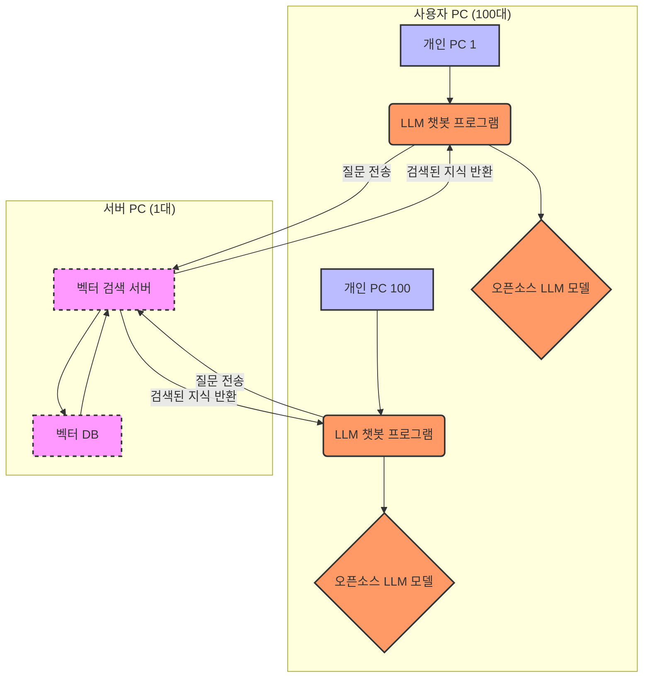

## 분산 컴퓨팅(Distributed Computing) LLM 챗봇 아키텍처

### **1. 개요**

본 문서는 <u>"약 100명의 사용자가 업무용으로 사내에서만 사용할 수 있는 챗봇을 어떻게 만들면 될까요?"</u>라는 질문에 대한 하나의 솔루션이다. 제한된 내부 리소스를 활용하여 100명의 사용자가 동시에 사용할 수 있는 LLM(대규모 언어 모델) 기반 챗봇 시스템의 아키텍처를 정의한다. 회사 보안 정책에 따라 외부 LLM API 사용은 금지되며, 모든 처리는 내부 네트워크에서 이루어진다.

---

### **2. 시스템 구성 요소**

#### **2.1. 서버 PC (1대)**

- **역할**: RAG(Retrieval-Augmented Generation) 시스템의 지식 기반을 담당한다.
- **주요 기능**:
  - **벡터 DB**: 회사 내부 문서와 같은 지식 데이터를 벡터 형태로 저장하고 관리한다.
  - **벡터 검색 서버**: 사용자 질의에 대한 관련 문서를 벡터 DB에서 검색하여 반환한다. 이는 LLM 모델이 답변을 생성하는 데 필요한 **맥락(Context)**을 제공한다.

#### **2.2. 사용자 개인 PC (100대)**

- **역할**: LLM 추론 및 사용자 인터페이스를 담당한다.
- **주요 기능**:
  - **LLM 챗봇 프로그램**: 윈도우용 애플리케이션 형태로 사용자에게 배포된다.
  - **오픈소스 LLM 모델**: 챗봇 프로그램과 함께 각 개인 PC에 설치되며, 사용자의 질문과 서버에서 검색된 지식을 바탕으로 최종 답변을 생성한다.
  - **API 클라이언트**: 서버 PC의 벡터 검색 서버에 질의를 전송하고 결과를 수신한다.

---

### **3. 시스템 동작 흐름**

사용자가 개인 PC의 챗봇에 질문을 입력하면, 다음과 같은 순서로 답변이 생성된다.

1.  **질문 입력**: 사용자가 챗봇 프로그램에 질문을 입력한다.
2.  **벡터 검색 요청**: 챗봇 프로그램은 사용자의 질문을 서버 PC의 벡터 검색 서버에 전송한다.
3.  **지식 검색**: 서버 PC는 수신된 질문을 벡터화한 후, 벡터 DB에서 가장 유사한 지식(문서 청크)을 검색하여 반환한다.
4.  **정보 전달**: 서버 PC는 검색된 지식 텍스트를 다시 사용자 PC의 챗봇 프로그램으로 전송한다.
5.  **답변 생성**: 사용자 PC에 설치된 LLM 모델은 **사용자의 질문**과 **서버로부터 받은 지식**을 함께 입력받아 최종 답변을 생성한다.
6.  **답변 출력**: 챗봇 프로그램은 생성된 답변을 사용자에게 보여준다.

---

### **4. 기술적 고려 사항**

#### **4.1. LLM 모델 경량화**

- **문제**: 개인 PC의 성능은 상이하며, 일반적인 LLM 모델은 높은 사양을 요구한다.
- **해결책**:
  - **양자화(Quantization)**: 모델의 크기를 줄여 메모리 사용량을 최소화한다.
  - **GGUF 포맷**: CPU 환경에서도 효율적인 추론이 가능한 모델 포맷을 사용한다.

#### **4.2. 벡터 DB 성능 최적화**

- **문제**: 100명의 동시 접속 시 벡터 검색 서버에 병목 현상이 발생할 수 있다.
- **해결책**:
  - **효율적인 인덱스 사용**: HNSW(Hierarchical Navigable Small World)와 같은 최신 인덱스 기술을 적용하여 검색 속도를 극대화한다.

#### **4.3. 관리 및 업데이트**

- **문제**: 100대의 PC에 분산된 모델과 프로그램을 관리하고 업데이트하는 것은 복잡하다.
- **해결책**:
  - **중앙 관리 시스템**: 중앙 서버를 통해 챗봇 프로그램과 LLM 모델의 업데이트를 배포하는 시스템을 구축하여 일관된 버전 관리를 수행한다.

---

### **5. 아키텍처 구성도**

---

### **6. 분석 설계 및 구현**

#### 1. **PRD (제품 요구사항 문서)**: **"무엇을(What)" 만들 것인가?**

- **목적**: 프로젝트의 목표, 비즈니스 가치, 사용자 스토리, 기능 요구사항 등 제품의 최종적인 모습을 정의한다.
- **역할**: 모든 이해관계자(기획, 개발, 디자인 등)가 '우리가 만들고자 하는 것이 이것이다'라는 공통의 목표를 설정하는 기준점이 된다.
- **Cursor 챗모드 설정**: `Add custom mode`에 <https://playbooks.com/modes>의 PRD 적용
- **사용한 프롬프트**: `@사내_사용자100명_챗봇_만들기.md` 이 아키텍처에서 필요한 챗봇을 만들어야해. 챗봇은 윈도우용 애플리케이션으로 만들거야. 고려해야할 내용을 정리해줘.

#### 2. **Design (기술 설계 문서)**: **"어떻게(How)" 만들 것인가?**

- **목적**: PRD에 명시된 요구사항을 기술적으로 어떻게 구현할지 구체적인 계획을 세운다. 시스템 아키텍처, 데이터베이스 스키마, API 명세, 컴포넌트 간의 상호작용 등을 정의한다.
- **역할**: 개발자들이 따라야 할 기술적인 청사진을 제공하여, 구현 과정에서의 시행착오를 줄이고 일관성 있는 결과물을 만들도록 돕는다.
- **사용한 프롬프트**: `@prd.md` 를 바탕으로 설계(design) 문서를 작성해줘. 주요 기술스택은 python, LangGraph, Ollama, PGVector를 사용할 거야.

#### 3. **Task List (작업 목록)**: **"실제로(Action)" 무엇을 할 것인가?**

- **목적**: 기술 설계 문서에 따라 실제 개발에 필요한 작업들을 구체적인 단위로 나누고 목록화한다.
- **역할**: 프로젝트의 진행 상황을 추적하고, 각 개발자가 어떤 작업을 맡아야 하는지 명확하게 분배하는 실행 계획의 역할을 한다.
- **사용한 프롬프트**: `@design.md` 를 바탕으로 task list를 체크박스 형식으로 작성해줘.
