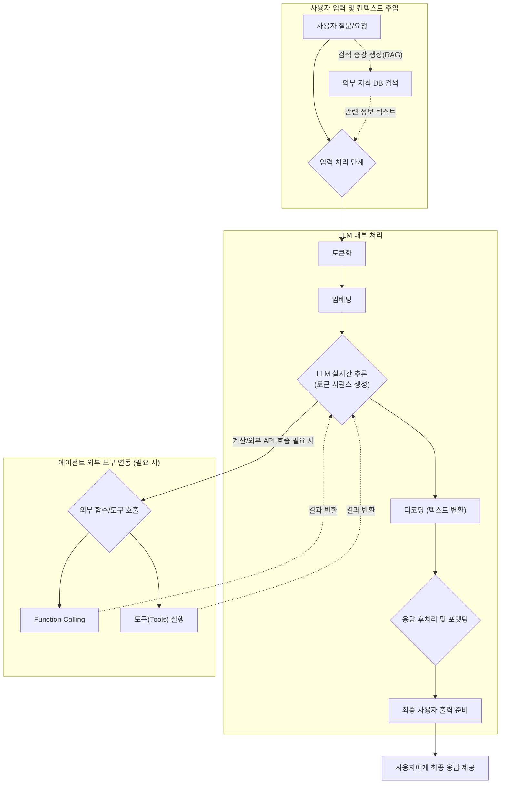

# 챗GPT와 같은 생성형 AI 서비스 작동 원리 이해하기

## 1. 생성형 AI 서비스의 핵심 구성 요소

- **거대 언어 모델(LLM)**: 서비스의 '두뇌' 역할, 기본적인 언어 이해 및 생성 능력 제공
- **프롬프트 엔지니어링**: 사용자 의도를 AI에 전달하는 방법, 효과적인 상호작용의 중요성
- **외부 도구 연동 (Tools/Functions)**: LLM의 한계 극복을 위한 외부 기능(계산, 검색 등) 통합의 필요성
- **메모리 (Memory)**: 대화의 맥락을 유지하고 장기적인 상호작용을 가능하게 하는 요소

## 2. ChatGPT와 같은 서비스의 작동 원리 심층 분석

- **입력 처리 및 컨텍스트 주입 단계**: 사용자 질문/요청의 LLM 입력 전 처리 과정
  - **검색 증강 생성(RAG)**: 사용자의 질문이 주어졌을 때, LLM에 그 질문을 온전히 건네기 **전**에, 외부 벡터 데이터베이스에서 관련 최신 정보나 내부 문서를 먼저 검색하여 관련 문맥(Context)을 확보한다.
  - 이렇게 모인 사용자의 자연어 입력(질의 + 검색 내용)은 LLM이 이해할 수 있는 형태의 '토큰'과 숫자 데이터인 '임베딩 벡터'로 변환되어 모델에 입력된다.
- **LLM 실시간 추론 (Inference) 단계**: 주입된 질문(및 배경지식)을 바탕으로 LLM이 맥락을 이해하고 실시간으로 다음 토큰을 예측하여 시퀀스를 생성해 내는 과정이다.
  - 이 단계는 서비스가 매번 새롭게 모델을 훈련하는 것이 아니다. 이미 사전에 방대한 지식을 **학습(Pre-training)**하고 인간의 피드백으로 미세 조정(**RLHF**)이 완료된 '파라미터/가중치'를 활용하여 즉각적으로 다음 단어를 계산해 추론해 내는 실시간 과정이다.
- **응답 후처리 단계**: LLM이 생성해낸 원시 예측 결과를 가공하여 사용자에게 전달하는 과정이다.
  - **디코딩 및 포맷팅**: LLM이 생성한 숫자 형태의 토큰 시퀀스를 곧바로 인간의 문자로 바꾸는 과정(디코딩)을 먼저 거친다. 그런 다음 비속어 필터링, 마크다운 렌더링, 시스템 UX에 맞춘 스타일 포맷팅 등 후처리를 통해 사용자가 읽기 좋은 최종 출력물을 완성한다.
- **에이전트 외부 도구 연동 (Function Calling/Tools)**: LLM이 실시간 텍스트 추론 중간에, 자신의 한계(계산 불가, 외부 시스템 제어 등)를 인지하고 외부 도구와 능동적으로 상호작용하는 흐름이다.
  - 질문을 이해하는 중 날씨 API 호출이나 결제 시스템 제어가 필요하다고 LLM 스스로 판단하면, 텍스트 생성을 잠시 멈추고 외부 도구(Tools)의 실행 코드(Function Calling)를 애플리케이션에 요청한다.
  - 외부 도구의 실행 결과값이 다시 LLM에게 반환되면, 그 데이터를 바탕으로 LLM은 최종 답변 생성을 이어나간다. (LangChain 프레임워크가 이러한 Agent 기능을 강력하게 지원한다.)

## 3. 실제 서비스 예시를 통한 이해

- **간단한 질의응답 챗봇 서비스 작동 시나리오**: 사용자가 질문을 입력하면, 서비스는 이를 LLM에 전달하고, LLM이 생성한 답변을 받아 사용자에게 보여주는 기본적인 흐름이다. 여기서는 주로 LLM 자체의 언어 이해 및 생성 능력이 활용된다.
- **외부 검색 기능을 활용하는 챗봇 서비스 작동 시나리오**: 사용자가 최신 뉴스나 특정 웹사이트 정보를 요청할 경우, 서비스는 LLM이 판단하여 웹 검색 도구를 호출한다. 웹 검색 결과가 다시 LLM에 전달되어 답변을 보강하고, 이를 사용자에게 제공하는 과정이다. 이는 RAG의 개념이 서비스 작동에 적용되는 한 예시이다. LangChain과 같은 프레임워크는 이러한 복잡한 도구 연동 및 다단계 추론 과정을 효율적으로 구성하고 관리하는 데 사용될 수 있다.

## 4. 결론: 생성형 AI 서비스 개발의 방향성

- **사용자 중심의 서비스 설계 중요성**: 단순히 LLM의 능력을 보여주는 것을 넘어, 사용자의 실제 문제 해결에 기여하고 편의성을 제공하는 서비스 설계가 핵심이다.
- **LLM의 발전과 서비스 활용 가능성의 확장**: LLM 기술은 지속적으로 발전하고 있으며, 이에 따라 생성형 AI 서비스의 적용 범위와 기능 또한 무한히 확장될 것이다.
- **윤리적 고려사항 및 안전한 서비스 개발의 필요성**: 환각, 편향, 데이터 프라이버시 등 LLM의 한계와 윤리적 문제점을 인지하고, 이를 최소화하며 사용자에게 안전하고 신뢰할 수 있는 서비스를 제공하는 것이 중요하다.
