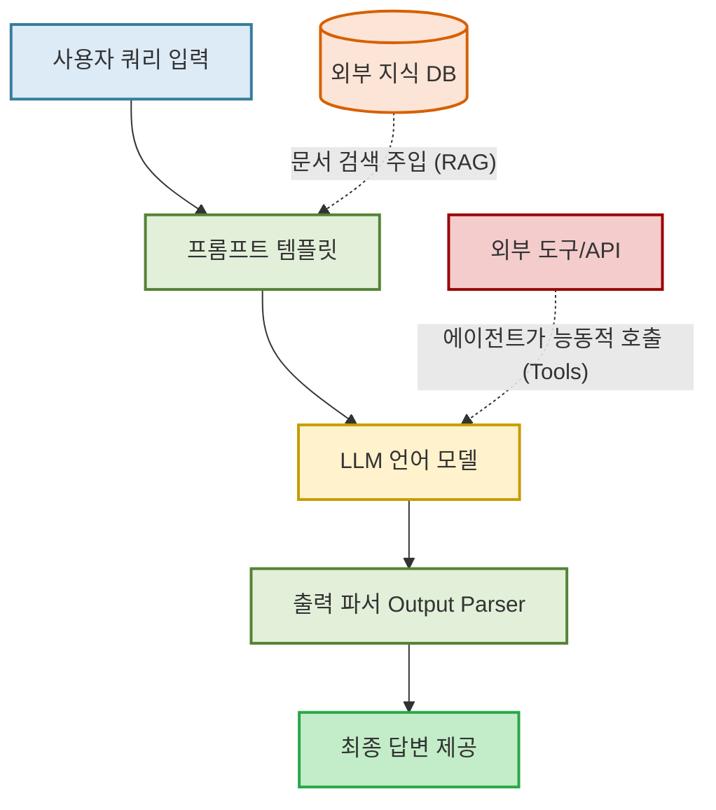

## 랭체인(LangChain): LLM 애플리케이션 개발의 첫걸음

### **1. 왜 이 기술들을 배워야 할까?**

우리는 빠르게 변화하는 기술 시대에 살고 있다. 새로운 도구와 프레임워크가 매일 쏟아진다. 이럴 때일수록 "잘 변하지 않는 지식에 더 많은 시간을 투자하자!"라는 학습 철학은 매우 중요하다. 복잡하고 빠르게 변하는 LLM 애플리케이션 생태계 속에서, 근본적인 원리와 아키텍처를 이해하는 것이 장기적으로 가장 큰 자산이 될 것이다.

---

### **2. LLM 애플리케이션 아키텍처의 이해**

LLM 애플리케이션을 만든다는 것은 단순한 질문-답변을 넘어, 여러 단계를 거쳐 복잡한 작업을 수행하는 워크플로를 구축하는 것이다. 이 워크플로의 핵심을 이루는 아키텍처는 크게 다음과 같은 요소로 구성된다.

**2.1. 프롬프트 관리**

LLM에게 효과적인 지시를 내리는 기술이다.

**2.2. 도구 사용**

LLM이 외부 데이터베이스, API 등과 소통하여 원하는 작업을 수행하게 하는 기술이다.

**2.3. 체인/워크플로 (Chain)**

여러 구성 요소(프롬프트, LLM, 파서 등)를 레고 블록처럼 순차적으로 연결하여 하나의 완성된 파이프라인 흐름을 만드는 기술이다.

**2.4. 데이터 검색 (RAG, Retrieval-Augmented Generation)**

LLM이 모르거나 알 수 없는 사용자 맞춤 외부 문서를 미리 검색하여, 프롬프트에 지식을 덧붙임으로써 답변의 정확도를 높이는 기술이다.

이러한 아키텍처는 도구의 형태와 상관없이 모든 LLM 애플리케이션에 공통적으로 적용되는 '변하지 않는 기술'이다.

---

### **3. 다른 형태, 같은 아키텍처**

LLM 애플리케이션을 만드는 대표적인 세 가지 도구인 n8n, Dify, 그리고 랭체인은 모두 위에서 언급한 핵심 아키텍처 원리를 구현한다. 하지만 그 형태와 목적에는 분명한 차이가 있다.

**3.1. n8n & Dify (로우 코드/노 코드)**

이 도구들은 시각적인 인터페이스를 통해 사용 편의성을 극대화한다. 노드를 드래그 앤 드롭으로 연결하여 복잡한 아키텍처를 직관적으로 구현할 수 있다. 이는 개발 지식이 없더라도 빠르게 아이디어를 프로토타입으로 만드는 데 매우 효과적이다. 마치 이미 만들어진 **'레고 블록 조립 세트'**를 가지고 정해진 규칙에 따라 완성품을 빠르게 만드는 것과 같다.

- **n8n**: 일반적인 업무 자동화에 강력한 노코드 툴로, 수많은 외부 서비스(SaaS) 연동 노드를 시각적으로 연결해 데이터 파이프라인을 구축한다.
- **Dify (또는 Flowise)**: LLM 앱 전용으로 설계된 오픈소스 로우코드 플랫폼으로, 프롬프트 엔지니어링, RAG 파이프라인 구성, 에이전트 설정 등을 직관적인 UI 보드로 제어할 수 있어 최근 실무에서 가장 각광받고 있다.

**3.2. 랭체인 (프로그래밍 프레임워크)**

파이썬 코드를 통해 LLM 아키텍처의 밑바닥부터 직접 구현하고 제어하는 개발 프레임워크이다. 프롬프트, 도구, 파서 등을 코드로 엮어내는 '체인'과 '에이전트' 개념을 제공하여, 개발자가 모든 과정을 세밀하게 튜닝할 수 있다. 이는 마치 **'엔진 설계부터 부품을 직접 조립하여 나만의 고성능 자동차를 제작'**하듯이, 정교하고 확장성 높은 상용 수준의 애플리케이션을 구축하는 데 필수적이다.

---

### **4. 왜 랭체인을 먼저 학습해야 하는가?**

n8n이나 Dify 같은 블록 조립 도구들이 LLM 애플리케이션의 '운전법'과 '조립법'을 가르쳐준다면, 랭체인은 LLM 애플리케이션의 **'엔진 설계 원리'**를 가르쳐준다.

**4.1. 아키텍처의 본질적 이해**

랭체인을 학습하면 '체인'이 어떻게 동작하고, '도구'가 어떻게 LLM과 상호작용하는지 코드로 직접 구현하게 된다. 이 과정에서 우리는 로우 코드/노 코드 도구 뒤에 숨겨진 핵심 원리를 깊이 있게 파악할 수 있다.

**4.2. 무한한 확장성과 제어력**

랭체인을 통해 얻은 지식은 특정 도구에 국한되지 않는다. 어떤 새로운 도구가 나오더라도, LLM 아키텍처에 대한 근본적인 이해가 있다면 빠르게 적응하고 응용할 수 있다. 코드를 통한 세밀한 제어는 상용 서비스의 안정성과 확장성을 보장하는 핵심 능력이다.

**4.3. 결론**

우리는 눈앞의 편리함에 만족하기보다, 잘 변하지 않는 기술인 LLM 아키텍처의 핵심을 꿰뚫는 랭체인에 더 많은 시간을 투자해야 한다. 이 지식은 어떤 기술 변화 속에서도 흔들리지 않는 개발자로서의 강력한 무기가 되어줄 것이다.
