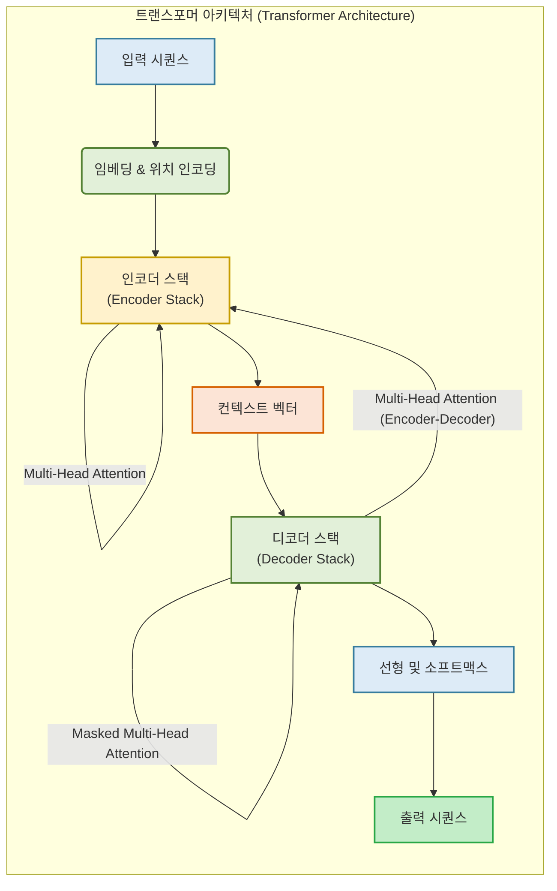
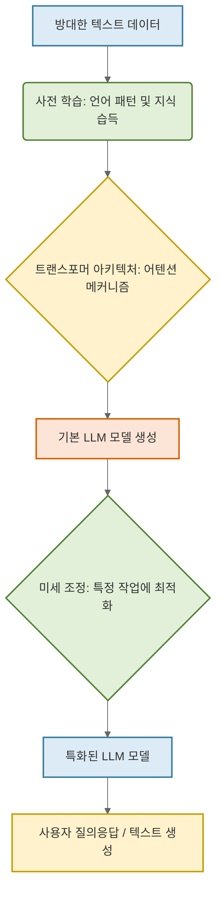
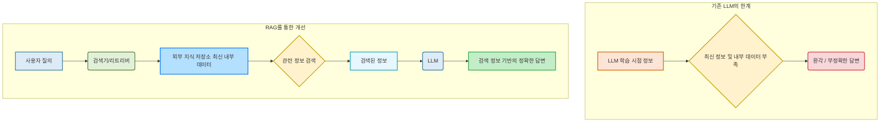

### **1. LLM(거대 언어 모델)이란 무엇인가?**

**1.1. 정의**

LLM(Large Language Model)은 대규모 텍스트 데이터를 학습하여 인간의 언어를 이해하고, 생성하며, 다양한 언어 관련 작업을 수행할 수 있는 인공지능 모델이다. 이는 수십억에서 수천억 개에 이르는 매개변수를 가지며, 방대한 양의 웹 문서, 책, 대화 기록 등을 학습함으로써 언어의 복잡한 패턴과 맥락을 습득하게 된다. LLM은 단순히 단어를 나열하는 것을 넘어, 문법, 의미론, 세계 지식, 추론 능력 등을 바탕으로 인간과 유사한 수준의 언어 처리 능력을 보이는 것이 특징이다.

**1.2. 작동 원리 (개념적 설명)**

LLM은 복잡한 인공지능 모델이지만, 그 작동 원리는 크게 세 가지 단계로 나누어 이해할 수 있다.

**1.2.1. 트랜스포머 아키텍처**

LLM의 핵심 기반 기술은 '트랜스포머(Transformer)'라는 신경망 아키텍처이다. 트랜스포머는 문장 내의 단어들 간의 관계를 파악하는 데 특화된 '어텐션 메커니즘(Attention Mechanism)'을 활용한다. 이는 모델이 문장 전체를 한 번에 보고 중요한 부분에 집중함으로써, 단어의 맥락적 의미를 효과적으로 학습할 수 있도록 돕는다. 예를 들어, "사과가 맛있다"라는 문장에서 '사과'가 과일임을 인식하고, "사과하다"라는 문장에서 '사과'가 동사임을 구분하는 것이 어텐션 메커니즘의 역할이다.

**1.2.2. 사전 학습 (Pre-training)**

사전 학습은 LLM이 방대한 텍스트 데이터(예: 인터넷 문서, 책, 위키백과 등)를 통해 언어의 규칙과 지식을 습득하는 과정이다. 이 단계에서 모델은 주로 '다음 단어 예측' 또는 '빈칸 채우기'와 같은 비지도 학습 방식으로 훈련된다. 이를 통해 모델은 단어 간의 통계적 관계, 문법 구조, 상식적인 지식 등을 자연스럽게 학습하게 된다. 예를 들어, "한국의 수도는 [ ]이다"라는 문장에서 빈칸에 '서울'이 올 확률이 높다는 것을 학습하는 식이다.

**1.2.3. 미세 조정 (Fine-tuning)**

사전 학습을 통해 범용적인 언어 능력을 갖춘 LLM은 특정 목적이나 작업에 맞춰 '미세 조정' 단계를 거친다. 이 단계에서는 비교적 적은 양의 특정 데이터(예: 챗봇 대화 데이터, 요약문 데이터)를 사용하여 모델의 성능을 최적화한다. 이를 통해 LLM은 특정 질문에 답변하거나, 번역을 수행하거나, 특정 스타일의 글을 생성하는 등 특화된 능력을 발휘할 수 있게 된다. 인간의 피드백을 활용하여 모델의 답변을 개선하는 '인간 피드백 기반 강화 학습(RLHF)' 또한 미세 조정의 중요한 부분이다.

**1.3. 주요 특징**

LLM은 그 규모와 작동 방식에서 비롯되는 몇 가지 주요 특징을 지닌다.

**1.3.1. 규모 (Scale)**

LLM은 수십억에서 수천억 개에 이르는 방대한 매개변수를 가진다. 이러한 거대한 규모는 모델이 훨씬 더 복잡하고 미묘한 언어 패턴을 학습할 수 있게 하며, 이는 인간의 언어 능력을 모방하는 데 중요한 역할을 한다. 학습 데이터의 양 또한 테라바이트(TB) 단위를 넘어 페타바이트(PB)에 이를 정도로 방대하다.

**1.3.2. 일반화 능력 (Generalization Ability)**

LLM은 특정 작업에 국한되지 않고 다양한 언어 관련 작업을 수행할 수 있는 뛰어난 일반화 능력을 지닌다. 사전 학습을 통해 습득한 광범위한 언어 지식 덕분에, 명시적으로 학습하지 않은 새로운 유형의 질문이나 지시에도 유연하게 대응하는 것이 가능하다. 이는 하나의 모델로 여러 기능을 수행할 수 있게 하는 강력한 장점이다.

**1.3.3. 예측 불가능한 능력 (Emergent Abilities)**

LLM이 특정 규모 이상으로 커지면, 사전 학습 단계에서는 명확히 예측하기 어려웠던 새로운 능력들이 나타나는 경우가 있다. 이를 '예측 불가능한 능력(Emergent Abilities)'이라고 부른다. 예를 들어, 사칙연산, 추론, 특정 프로그래밍 언어 이해 등은 모델의 크기가 커짐에 따라 갑자기 향상되거나 발현되는 능력들이다. 이는 LLM 연구의 중요한 발견 중 하나이며, 모델의 잠재력을 보여주는 지표이다.

---

### **2. LLM은 어떤 일을 할 수 있는가?**

LLM은 인간의 언어를 이해하고 생성하는 능력을 기반으로 매우 광범위한 분야에서 다양한 작업을 수행할 수 있다.

**2.1. 텍스트 생성**

LLM의 가장 기본적인 능력 중 하나는 주어진 입력에 따라 새로운 텍스트를 생성하는 것이다.

**2.1.1. 요약 및 번역**

LLM은 긴 문서나 대화 내용을 핵심만 추출하여 간결하게 요약할 수 있다. 또한, 한 언어의 텍스트를 다른 언어로 자연스럽게 번역하는 것이 가능하다. 이는 다국어 환경에서의 정보 접근성을 높이는 데 크게 기여한다.

**2.1.2. 글쓰기 (보고서, 코드, 시 등)**

다양한 형식과 목적에 맞는 글을 작성할 수 있다. 비즈니스 보고서, 마케팅 문구, 창의적인 시, 소설, 그리고 특정 프로그래밍 언어의 코드에 이르기까지, 사용자의 지시에 따라 맞춤형 텍스트를 생성하는 것이 가능하다. 이는 콘텐츠 제작, 소프트웨어 개발 등의 생산성을 크게 향상시킨다.

**2.1.3. 대화 (챗봇)**

LLM은 인간과 자연스러운 대화를 주고받는 챗봇 형태로 가장 널리 활용된다. 질문에 답변하고, 정보를 제공하며, 상담을 진행하거나, 사용자 요청에 따라 특정 작업을 수행하는 등 다양한 형태의 상호작용이 가능하다.

**2.2. 텍스트 이해 및 분석**

텍스트를 단순히 생성하는 것을 넘어, 주어진 텍스트의 의미를 깊이 있게 이해하고 분석하는 능력 또한 LLM의 중요한 기능이다.

**2.2.1. 질의응답 (Q&A)**

LLM은 주어진 문서나 방대한 지식 기반에서 사용자의 질문에 대한 가장 적절한 답변을 찾아 제공할 수 있다. 이는 정보 검색의 효율성을 극대화하고, 복잡한 질문에 대한 빠른 해답을 얻는 데 유용하다.

**2.2.2. 감성 분석**

텍스트에 담긴 감정, 즉 긍정적, 부정적, 중립적 태도 등을 파악하는 것이 가능하다. 이는 고객 피드백 분석, 여론 조사, 소셜 미디어 모니터링 등에서 활용될 수 있다.

**2.2.3. 정보 추출**

비정형 텍스트에서 특정 유형의 정보를 식별하고 추출하는 능력을 지닌다. 예를 들어, 뉴스 기사에서 인물, 장소, 시간 등의 개체를 추출하거나, 계약서에서 특정 조항이나 조건을 식별하는 데 사용될 수 있다.

**2.3. 기타 활용 분야**

LLM의 언어 처리 능력은 위에서 언급된 주요 기능 외에도 다양한 분야에 응용될 수 있다.

**2.3.1. 코드 생성 및 디버깅 보조**

개발자가 작성하는 코드를 보완하거나, 특정 기능을 수행하는 코드를 처음부터 생성할 수 있다. 또한, 기존 코드의 오류를 찾아내고 수정 방안을 제시하는 등 디버깅 과정을 지원하여 개발 생산성을 높이는 데 기여한다.

**2.3.2. 교육**

개인화된 학습 자료를 생성하거나, 학생들의 질문에 답변하고, 복잡한 개념을 쉽게 설명하는 등 교육 분야에서 보조 교사 역할을 수행할 수 있다. 이는 맞춤형 교육 환경을 구현하는 데 도움을 준다.

**2.3.3. 의료**

방대한 의학 문헌을 분석하여 진단을 보조하거나, 약물 상호작용에 대한 정보를 제공하고, 환자 상담에 필요한 정보를 제공하는 등 의료 전문가를 지원하는 데 활용될 수 있다.

---

### **3. LLM의 한계 및 고려 사항**

LLM은 강력한 능력을 지니지만, 완벽한 기술은 아니며 몇 가지 중요한 한계와 고려해야 할 윤리적 문제점을 지닌다.

**3.1. 환각 (Hallucination)**

LLM은 때때로 사실이 아닌 정보를 마치 사실인 것처럼 그럴듯하게 생성하는 경향이 있다. 이를 '환각(Hallucination)'이라고 부른다. 이는 모델이 학습 데이터에 없는 내용을 추론하거나, 잘못된 정보를 바탕으로 답변을 구성할 때 발생한다. 특히 정확한 정보가 요구되는 분야에서는 이러한 환각 현상이 심각한 문제를 야기할 수 있으므로, LLM의 답변을 맹신하지 않고 항상 검증하는 것이 중요하다.

**3.2. 편향 (Bias)**

LLM은 학습 데이터를 통해 세상을 학습한다. 만약 학습 데이터에 특정 성별, 인종, 직업 등에 대한 편향된 정보가 포함되어 있다면, 모델 또한 그러한 편향을 학습하여 답변에 반영할 수 있다. 이는 차별적인 발언을 생성하거나, 특정 그룹에 대한 고정관념을 강화하는 결과를 초래할 수 있다. 이러한 편향 문제를 해결하기 위한 연구가 활발히 진행 중이지만, 현재로서는 LLM 활용 시 발생할 수 있는 편향에 대해 인지하고 주의하는 것이 필요하다.

**3.3. 윤리적 문제**

LLM의 발전은 다양한 윤리적 문제들을 야기한다.

- **데이터 프라이버시**: 학습 데이터에 포함된 개인 정보가 모델을 통해 노출될 위험이 있다.
- **오용 가능성**: 가짜 뉴스 생성, 사이버 공격, 사기 등 악의적인 목적으로 LLM이 사용될 가능성이 존재한다.
- **저작권**: LLM이 생성한 콘텐츠의 원작자 및 저작권에 대한 법적, 윤리적 논의가 필요하다.
- **노동 시장 영향**: LLM으로 인해 특정 직업이 대체되거나 변화될 수 있으며, 이에 대한 사회적 대비가 요구된다.

이러한 문제들은 LLM 기술 개발 및 활용에 있어 지속적으로 논의되고 해결 방안이 모색되어야 할 부분이다.

**3.4. 최신 정보 부족 및 내부 데이터 미학습**

대부분의 LLM은 특정 시점까지의 공개 데이터로 학습된다. 따라서 그 이후에 발생한 사건이나 최신 정보에 대해서는 알지 못하거나 부정확한 답변을 제공할 수 있다. 또한, 회사 내부 문서, 특정 산업 분야의 전문 자료와 같은 비공개 데이터는 LLM 학습에 사용되지 않으므로, 이러한 정보에 기반한 질문에는 답변할 수 없다.

이러한 한계를 극복하기 위해 '검색 증강 생성(Retrieval Augmented Generation, RAG)'과 같은 기술의 필요성이 대두된다. RAG는 LLM이 답변을 생성하기 전에 외부의 최신 정보나 특정 도메인의 내부 데이터를 검색하고, 그 내용을 바탕으로 답변을 보강하는 방식이다. 이를 통해 LLM은 학습 시점 이후의 정보나 접근할 수 없었던 비공개 데이터에 대해서도 정확하고 신뢰할 수 있는 답변을 제공할 수 있게 된다. 따라서 실시간 정보나 특정 내부 정보가 필요한 경우에는 RAG와 같은 외부 도구 연동 방안을 반드시 고려해야 한다.

