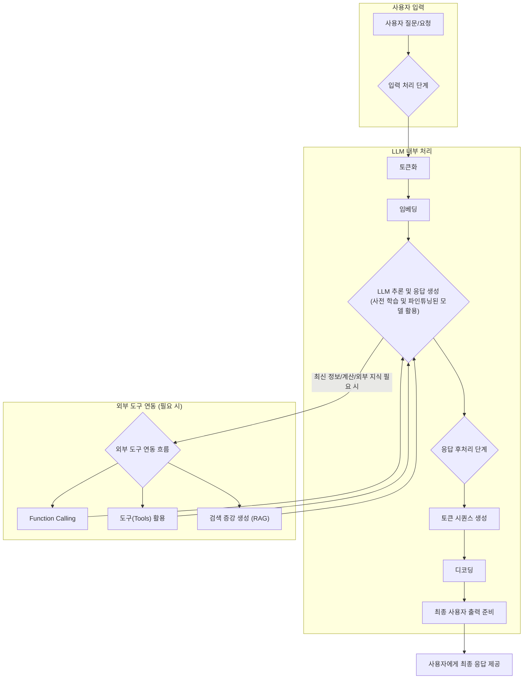

# 챗GPT와 같은 생성형 AI 서비스 작동 원리 이해하기

## 1. 생성형 AI 서비스의 핵심 구성 요소

- **거대 언어 모델(LLM)**: 서비스의 '두뇌' 역할, 기본적인 언어 이해 및 생성 능력 제공
- **프롬프트 엔지니어링**: 사용자 의도를 AI에 전달하는 방법, 효과적인 상호작용의 중요성
- **외부 도구 연동 (Tools/Functions)**: LLM의 한계 극복을 위한 외부 기능(계산, 검색 등) 통합의 필요성
- **메모리 (Memory)**: 대화의 맥락을 유지하고 장기적인 상호작용을 가능하게 하는 요소

## 2. ChatGPT와 같은 서비스의 작동 원리 심층 분석

- **입력 처리 단계**: 사용자 질문/요청의 LLM 입력 전 처리 과정 (토큰화, 임베딩)
  - 사용자의 자연어 입력은 LLM이 이해할 수 있는 숫자 형태의 '토큰'으로 변환된다. 이러한 토큰들은 LLM의 내부 처리 단위이며, 각 토큰은 임베딩 벡터로 변환되어 모델에 입력되는 과정이다. 이는 서비스가 사용자 입력의 의미를 정확하게 파악하기 위한 첫 단계이다.
- **LLM 추론 및 응답 생성 단계**: 사용자 질문을 기반으로 LLM이 응답을 생성하는 과정이다. 이 단계에서는 **사전 학습(Pre-training)**과 **파인튜닝(Fine-tuning) 및 강화 학습(RLHF)**을 통해 이미 최적화된 거대 언어 모델이 활용된다.
  - **사전 학습된 모델의 활용**: LLM은 방대한 텍스트 데이터로 사전 학습되어 일반적인 언어 패턴, 사실 정보, 추론 능력 등을 습득한다. 이 사전 학습 과정은 서비스 배포 전에 완료된다.
  - **파인튜닝 및 강화 학습(RLHF)의 역할**: 사전 학습된 모델은 특정 목적(예: 챗봇 대화)에 맞게 미세 조정(Fine-tuning)된다. 특히 인간 피드백 기반 강화 학습(RLHF)은 실제 사용자의 선호도와 안전성 기준에 따라 모델의 응답을 개선하는 핵심적인 과정으로, 이 역시 서비스 배포 전에 모델을 최적화하는 데 사용된다.
- **응답 후처리 단계**: LLM이 생성한 원시 응답을 사용자에게 전달하기 위해 가공하는 과정이다.
  - **토큰 시퀀스 생성 및 디코딩**: LLM은 내부적으로 토큰 시퀀스를 생성하며, 이 토큰 시퀀스는 다시 인간이 이해할 수 있는 자연어 문장으로 디코딩된다.
  - **최종 사용자 출력 준비**: 서비스는 단순히 LLM의 원시 출력을 제공하는 것이 아니라, 이를 사용자가 쉽게 이해하고 활용할 수 있도록 적절한 형식과 스타일로 후처리하는 역할을 한다.
- **외부 도구 연동 흐름**: LLM이 학습된 지식에 한계가 있어 최신 정보나 특정 도메인 지식, 계산 능력 등이 필요할 때 외부 도구와 연동하여 그 한계를 극복한다.
  - **Function Calling**: LLM은 사용자의 질의를 분석하여 특정 기능을 수행하는 외부 함수(또는 도구)를 호출할 필요가 있다고 판단할 수 있다. 예를 들어, 날씨 정보를 묻는 질문에 대해 LLM은 날씨 API 호출을 결정하는 것이다.
  - **도구(Tools)의 활용**: LangChain과 같은 프레임워크는 다양한 외부 도구(웹 검색, 계산기, 데이터베이스 접근 등)를 LLM과 연결하는 인터페이스를 제공한다. LLM은 이러한 도구 중 어떤 것을 사용할지, 그리고 어떤 인수를 전달할지를 스스로 결정하는 능력을 가진다.
  - **검색 증강 생성(RAG)**: LLM이 학습하지 않은 최신 정보나 특정 문서(예: 기업 내부 문서, 개인 자료)를 활용하여 답변을 생성할 필요가 있을 때 사용된다. 서비스는 사용자 질문과 관련된 문서를 외부 데이터베이스(벡터 저장소)에서 검색하고, 이 검색된 정보를 LLM에게 함께 제공하여 답변의 정확성과 신뢰성을 높이는 방식이다. 이는 LLM이 '환각' 현상을 줄이고 더욱 풍부한 정보를 제공하도록 돕는 중요한 서비스 작동 원리이다.

## 3. 실제 서비스 예시를 통한 이해

- **간단한 질의응답 챗봇 서비스 작동 시나리오**: 사용자가 질문을 입력하면, 서비스는 이를 LLM에 전달하고, LLM이 생성한 답변을 받아 사용자에게 보여주는 기본적인 흐름이다. 여기서는 주로 LLM 자체의 언어 이해 및 생성 능력이 활용된다.
- **외부 검색 기능을 활용하는 챗봇 서비스 작동 시나리오**: 사용자가 최신 뉴스나 특정 웹사이트 정보를 요청할 경우, 서비스는 LLM이 판단하여 웹 검색 도구를 호출한다. 웹 검색 결과가 다시 LLM에 전달되어 답변을 보강하고, 이를 사용자에게 제공하는 과정이다. 이는 RAG의 개념이 서비스 작동에 적용되는 한 예시이다. LangChain과 같은 프레임워크는 이러한 복잡한 도구 연동 및 다단계 추론 과정을 효율적으로 구성하고 관리하는 데 사용될 수 있다.

## 4. 결론: 생성형 AI 서비스 개발의 방향성

- **사용자 중심의 서비스 설계 중요성**: 단순히 LLM의 능력을 보여주는 것을 넘어, 사용자의 실제 문제 해결에 기여하고 편의성을 제공하는 서비스 설계가 핵심이다.
- **LLM의 발전과 서비스 활용 가능성의 확장**: LLM 기술은 지속적으로 발전하고 있으며, 이에 따라 생성형 AI 서비스의 적용 범위와 기능 또한 무한히 확장될 것이다.
- **윤리적 고려사항 및 안전한 서비스 개발의 필요성**: 환각, 편향, 데이터 프라이버시 등 LLM의 한계와 윤리적 문제점을 인지하고, 이를 최소화하며 사용자에게 안전하고 신뢰할 수 있는 서비스를 제공하는 것이 중요하다.
