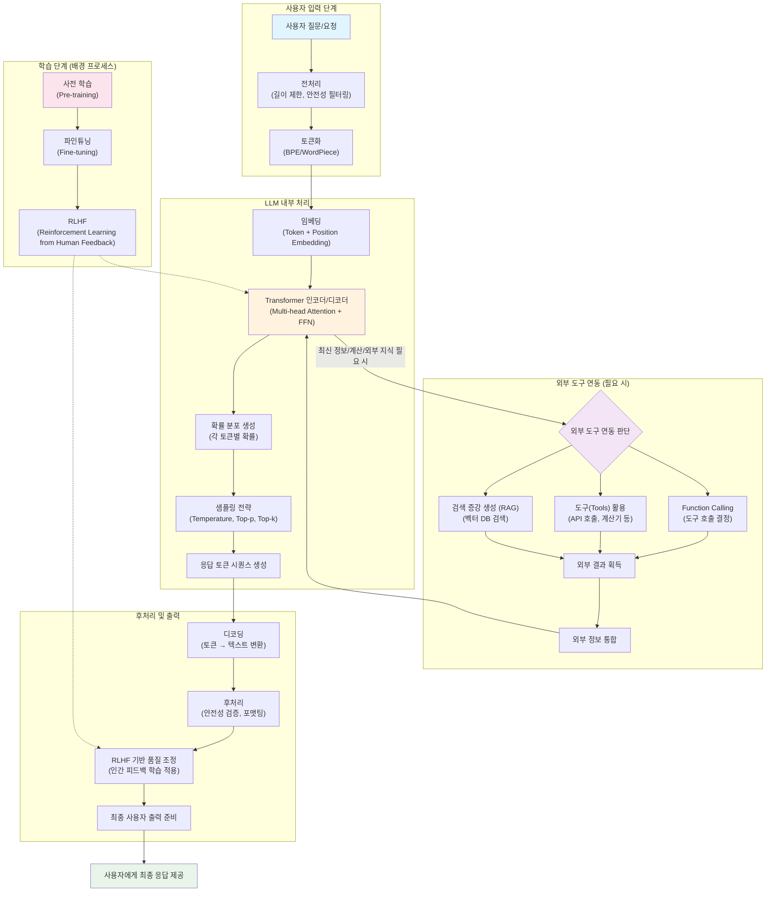

## **1. Chat GPT 작동 원리**



## 2. 구성 요소 상세 설명표

### 2.1. 사용자 입력 단계

| 구성 요소            | 설명                                            | 주요 기능                                              | 예시                                                          |
| -------------------- | ----------------------------------------------- | ------------------------------------------------------ | ------------------------------------------------------------- |
| **사용자 질문/요청** | 사용자가 AI에게 입력하는 모든 형태의 텍스트     | 대화의 시작점, 다양한 형태의 질문이나 명령 처리        | "파이썬으로 피보나치 수열을 만들어줘"                         |
| **전처리**           | 입력 텍스트를 모델이 처리할 수 있는 형태로 변환 | 길이 제한 적용, 유해 콘텐츠 필터링, 문자 인코딩 정규화 | 최대 토큰 수 제한, 욕설/혐오 표현 필터링                      |
| **토큰화**           | 텍스트를 작은 단위(토큰)로 분할하는 과정        | BPE(Byte Pair Encoding) 또는 WordPiece 알고리즘 사용   | "안녕하세요" → ["안녕", "하세요"] 또는 ["안", "녕하", "세요"] |

### 2.2. LLM 내부 처리

| 구성 요소          | 설명                              | 주요 기능                                                      | 예시                                                                        |
| ------------------ | --------------------------------- | -------------------------------------------------------------- | --------------------------------------------------------------------------- |
| **임베딩**         | 토큰을 수치 벡터로 변환           | Token Embedding + Position Embedding으로 의미와 위치 정보 표현 | "사과" → [0.2, -0.5, 0.8, ...] (512차원 벡터)                               |
| **Transformer**    | 핵심 신경망 아키텍처              | Multi-head Attention으로 문맥 이해, FFN으로 정보 변환          | 문장 내 단어들 간의 관계 파악, "그는 공을 찼다"에서 "그"와 "공"의 관계 이해 |
| **확률 분포 생성** | 다음에 올 토큰의 확률 계산        | 어휘집의 모든 토큰에 대해 확률값 할당                          | "날씨가" 다음에 "좋다"(0.3), "나쁘다"(0.2), "흐리다"(0.1) ...               |
| **샘플링 전략**    | 확률 분포에서 실제 토큰 선택 방법 | Temperature(창의성 조절), Top-p/Top-k(다양성 제어)             | Temperature=0.7로 적당한 창의성, Top-p=0.9로 상위 90% 후보에서 선택         |

### 2.3. 외부 도구 연동

| 구성 요소               | 설명                                       | 주요 기능                                  | 예시                                        |
| ----------------------- | ------------------------------------------ | ------------------------------------------ | ------------------------------------------- |
| **외부 도구 연동 판단** | 질문 해결을 위해 외부 도구가 필요한지 결정 | 실시간 정보, 계산, 특수 기능 필요성 판단   | "오늘 날씨" → 날씨 API 필요 판단            |
| **Function Calling**    | 적절한 외부 함수나 API 호출 결정           | 사용할 도구 선택, 파라미터 설정            | get_weather(location="서울", date="today")  |
| **도구 활용**           | 실제 외부 서비스나 계산기 사용             | API 호출, 수학 계산, 코드 실행 등          | 날씨 API에서 "서울, 맑음, 23°C" 데이터 수신 |
| **RAG**                 | 외부 지식베이스에서 관련 정보 검색         | 벡터 유사도 기반 문서 검색, 최신 정보 보강 | 사용자 질문과 유사한 문서를 벡터DB에서 검색 |

### 2.4. 후처리 및 출력

| 구성 요소               | 설명                                            | 주요 기능                                 | 예시                                    |
| ----------------------- | ----------------------------------------------- | ----------------------------------------- | --------------------------------------- |
| **디코딩**              | 토큰 시퀀스를 사람이 읽을 수 있는 텍스트로 변환 | 토큰 ID를 실제 문자/단어로 복원           | [1234, 5678, 9012] → "안녕하세요"       |
| **후처리**              | 최종 출력 전 품질 검증 및 포맷팅                | 안전성 재검증, 마크다운 포맷팅, 문법 검사 | 코드 블록 포맷팅, 유해 내용 최종 필터링 |
| **RLHF 기반 품질 조정** | 인간 피드백으로 학습된 모델을 통한 응답 최적화  | 도움성, 정확성, 안전성 기준으로 응답 개선 | 더 친절하고 정확한 톤으로 응답 조정     |

### 2.5. 학습 단계 (배경 프로세스)

| 구성 요소     | 설명                                       | 주요 기능                              | 시기                |
| ------------- | ------------------------------------------ | -------------------------------------- | ------------------- |
| **사전 학습** | 대량의 텍스트 데이터로 언어 모델 기본 학습 | 언어 패턴, 지식, 추론 능력 습득        | 모델 개발 초기 단계 |
| **파인튜닝**  | 특정 작업에 맞게 모델 세부 조정            | 대화형 AI로서의 역할 학습, 지시 따르기 | 사전 학습 후        |
| **RLHF**      | 인간 평가자의 피드백으로 모델 개선         | 유용하고 안전한 응답 생성 능력 향상    | 지속적 개선 과정    |

### 2.6. 데이터 흐름 요약

```
사용자 입력 → 전처리 → 토큰화 → 임베딩 → Transformer 처리
    ↓
외부 도구 필요시 ← 도구 연동 ← 판단
    ↓
확률 분포 생성 → 샘플링 → 토큰 생성 → 디코딩 → 후처리 → 최종 출력
```
