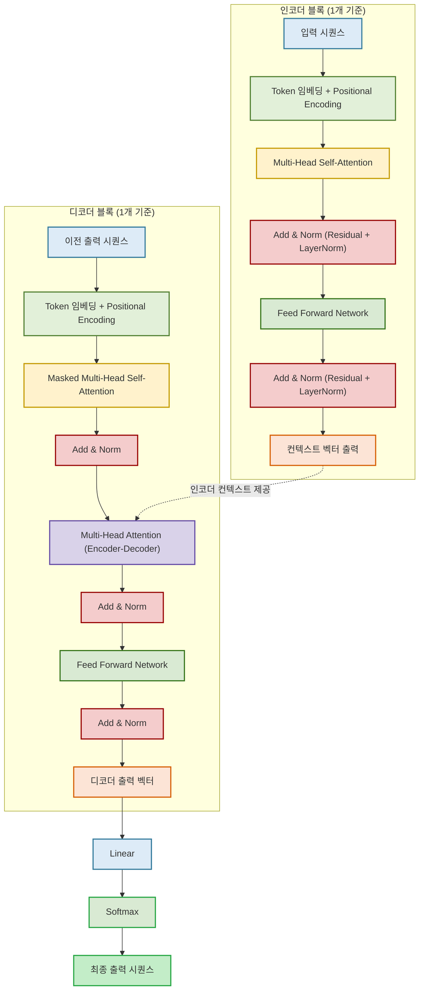

### **1. 보완된 트랜스포머 구조 (Residual, LayerNorm, Feed Forward 포함)**

| 구성 요소                     | 설명                                                                                          |
| ----------------------------- | --------------------------------------------------------------------------------------------- |
| **Add & Norm**                | Residual connection(잔차 연결)과 Layer Normalization을 의미함. 각 주요 서브 레이어 뒤에 위치. |
| **Feed Forward Network**      | 인코더 및 디코더 블록 내부에 존재. 2층의 fully connected layer (ReLU 포함).                   |
| **Masked Self-Attention**     | 디코더에서는 미래의 정보를 보지 않도록 마스킹 적용.                                           |
| **Encoder-Decoder Attention** | 디코더가 인코더의 출력(컨텍스트)을 참조함.                                                    |
| **Linear & Softmax**          | 디코더 출력 → 단어 분포로 변환하여 최종 출력 생성.                                            |

---

### **2. 트랜스포머와 기존 아키텍처의 주요 차이점**

**2.1. 처리 방식의 근본적 차이**

**트랜스포머**: 전체 시퀀스에 동시에 직접 접근 (Self-Attention)하여 병렬 처리
**RNN/LSTM**: 순차적으로 하나씩 처리하며 이전 상태를 다음으로 전달
**CNN**: 고정된 크기의 필터로 국소적 패턴을 병렬 처리

**2.2. 병렬 처리 능력**

**트랜스포머의 혁신**: 순환 유닛이 없어 RNN보다 훨씬 빠른 학습 시간

- 모든 위치의 정보를 동시에 계산
- GPU 최적화에 매우 유리

**기존 모델들의 한계**:

- RNN/LSTM: 순차 처리로 인한 병렬화 제약
- CNN: 지역적 처리는 병렬 가능하지만 전역 정보 파악 한계

**2.3. 장거리 의존성 처리**

**트랜스포머**: 각 단계에서 모든 다른 단계에 직접 접근하여 정보 손실이 거의 없음
**RNN/LSTM**: 그래디언트 소실/폭발 문제로 장거리 의존성 처리 어려움
**CNN**: 여러 층을 쌓아야 넓은 수용 영역 확보 가능

**2.4. 어텐션 메커니즘**

**트랜스포머의 핵심**: Self-Attention 메커니즘으로 순환이나 합성곱 없이 시퀀셜 데이터 처리

- 모든 위치 간의 관계를 명시적으로 모델링
- 어떤 부분에 집중할지 학습을 통해 결정

**기존 모델들**:

- RNN: 숨겨진 상태를 통한 암시적 어텐션
- CNN: 위치별 고정된 가중치

**2.5. 메모리와 계산 복잡도**

**트랜스포머**:

- 시퀀스 길이에 대해 O(n²) 복잡도 (Self-Attention)
- 긴 시퀀스에서 메모리 사용량 증가

**RNN/LSTM**:

- O(n) 복잡도로 메모리 효율적
- 하지만 순차 처리로 인한 시간 비효율

**CNN**:

- 고정된 필터 크기로 일정한 복잡도
- 지역적 패턴에 특화

**2.6. 적용 분야별 특징**

**트랜스포머**: 병렬 처리, 장거리 의존성, 하드웨어 활용도 향상으로 순차 작업의 새로운 선택지

- 자연어 처리의 혁신 (GPT, BERT)
- 컴퓨터 비전에도 확장 (Vision Transformer)

**기존 아키텍처들**: 여전히 특정 상황에서 가치 보유

- RNN: 실시간 스트리밍 데이터, 메모리 제약 환경
- CNN: 이미지 처리, 지역적 패턴 인식

결국 트랜스포머의 가장 큰 혁신은 **"순차적 처리의 제약을 벗어나 전역적 관점에서 모든 정보에 동시 접근"** 할 수 있게 한 것입니다. 이것이 현재 LLM 시대를 가능하게 한 핵심 아이디어죠!
