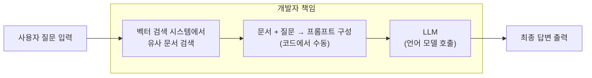
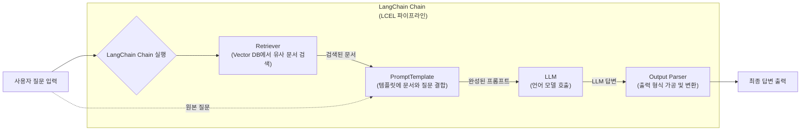

# AI 서비스 개발의 만능 도구, LangChain!

## 1. LangChain이란 무엇인가?

LangChain은 대규모 언어 모델(LLM)을 활용하여 복잡하고 지능적인 애플리케이션을 개발하는 데 도움을 주는 오픈소스 프레임워크다. **2022년 10월, 해리슨 체이스(Harrison Chase)가 오픈 소스 프로젝트로 처음 시작**했으며, LLM의 잠재력을 최대한 끌어내어 실제 서비스에 적용하는 과정을 간소화하고 개발 효율성을 높이는 데 중점을 둔다. 단순히 LLM을 호출하는 것을 넘어, 여러 구성 요소를 마치 체인처럼 연결하고 상호 작용하게 함으로써, 더 정교하고 다재다능한 AI 솔루션을 구축할 수 있게 한다.

## 2. LLM API 사용의 한계

LLM 기반 서비스를 개발할 때, 많은 개발자는 OpenAI나 Google 같은 LLM 제공사가 제공하는 **LLM API**를 직접 호출하는 방식부터 시작한다. 이 방법은 간단한 질의응답이나 텍스트 요약 같은 단일 작업에는 효과적이다. 하지만 실제 서비스로 발전시키려면 아래와 같은 한계에 부딪히게 된다.

- **단순한 질의응답을 넘어선다:** 챗봇이 사용자의 질문에 답하기 위해 외부 데이터를 검색하고, 그 내용을 요약한 뒤, 최종 답변을 생성하는 등 여러 단계를 거쳐야 하는 경우, 이 모든 과정을 개발자가 직접 코드로 구현해야 한다.
- **외부 데이터 연동이 어렵다:** LLM이 학습하지 않은 최신 정보나 기업 내부 문서 같은 특정 데이터를 활용하려면, 외부 데이터베이스나 API와 LLM을 연동하는 복잡한 로직이 필요하다.
- **대화 맥락 유지가 번거롭다:** 챗봇과 같이 이전 대화 내용을 기억해야 하는 서비스에서, 모든 대화 기록을 직접 관리하고 LLM에 전달하는 것은 번거롭고 실수할 가능성이 높다.
- **도구 활용 및 판단 기능의 부재:** LLM이 계산기나 웹 검색 엔진 같은 외부 도구를 사용해 스스로 판단하고 작업을 수행하게 하려면, LLM의 응답을 분석하고 적절한 도구를 호출하는 로직을 직접 짜야 한다.

이러한 문제들은 개발 시간을 늘리고 코드의 복잡성을 키워, LLM 기반 서비스 개발의 진입 장벽을 높이는 주요 원인이 된다.

## 3. LangChain, LLM 애플리케이션 개발의 문제 해결사

LangChain은 위에서 언급된 문제들을 해결하기 위해 탄생했다. LangChain은 LLM 기반 애플리케이션 개발에 필요한 다양한 구성 요소를 모듈화하고 표준화하여 제공함으로써, 개발자가 복잡한 로직을 직접 구현할 필요 없이 효율적으로 서비스를 구축할 수 있도록 돕는다.

### LangChain의 핵심 모듈

LangChain의 주요 개념들은 다음과 같다.

- **Models:** OpenAI, Hugging Face 등 다양한 LLM 모델과 통합된 인터페이스를 제공한다.
- **Prompts:** LLM에 전달할 프롬프트를 효과적으로 생성하고 관리할 수 있도록 템플릿 기능을 제공한다.
- **Chains:** 여러 LLM 호출이나 다른 구성 요소를 순차적으로 연결하여 복잡한 워크플로우를 생성한다.
- **Retrieval:** 외부 데이터를 검색하고 LLM이 활용할 수 있는 형태로 변환하는 기능을 제공한다.
- **Agents:** LLM이 스스로 판단하여 어떤 도구를 사용하고 어떤 액션을 취할지 결정하도록 돕는다.
- **Memory:** 이전 대화 내용을 기억하고 LLM에 전달하여, 대화의 맥락을 유지하고 자연스러운 다중 턴 대화를 가능하게 한다.

## 4. 요약 비교표: LLM API vs LangChain

| 항목                                    | LLM API만 사용                          | LangChain 사용                       |
| --------------------------------------- | --------------------------------------- | ------------------------------------ |
| **프롬프트 관리**                       | 직접 문자열 조합 및 삽입                | `PromptTemplate`으로 구성 요소화     |
| **외부 도구 호출 (예: 계산기, 웹검색)** | 응답 파싱 → 직접 로직 작성              | `Agent`가 자동 판단 및 실행          |
| **외부 지식 검색 (RAG)**                | 검색 로직 + 임베딩 + 프롬프트 직접 구성 | `Retriever` + `Chain`으로 구성       |
| **대화 맥락 유지**                      | 대화 기록을 직접 저장/삽입              | `Memory`가 자동 관리                 |
| **복잡한 흐름 처리**                    | 조건문, 반복문 등 직접 구현             | `Chain`, `AgentExecutor`로 추상화    |
| **확장성과 재사용성**                   | 코드 재사용이 어려움                    | 구성 요소별 재사용 용이              |
| **LLM 교체**                            | API 구조 변경 시 전면 수정              | 공통 인터페이스로 유연하게 교체 가능 |

## 5. LangChain이 적합한 경우 vs. 부적합한 경우

LangChain은 강력하지만, 모든 프로젝트에 적합한 만능 해결책은 아니다.

### **적합한 경우**

1.  **복잡한 워크플로우를 구성해야 할 때:** 여러 단계의 논리(데이터 검색 -> 요약 -> 답변 생성)가 필요한 애플리케이션.
2.  **외부 데이터 및 도구 연동이 필요할 때:** 실시간 정보, 내부 문서 등을 LLM이 활용해야 하는 경우.
3.  **LLM 모델을 유연하게 전환하고 싶을 때:** 특정 LLM에 종속되지 않고 다양한 모델을 테스트하거나 서비스에 적용하려는 경우.
4.  **확장 가능한 AI 서비스를 개발할 때:** 단순한 챗봇을 넘어 복잡한 에이전트 시스템을 구축하려는 경우.

### **부적합한 경우**

- **간단한 LLM 기능만 사용하는 프로젝트:** 단순히 LLM을 호출하여 텍스트를 생성하거나 요약하는 등 매우 간단한 기능을 구현할 때는 LangChain의 오버헤드가 부담될 수 있다. 이 경우에는 프레임워크 없이 직접 API를 사용하는 편이 더 효율적일 수 있다.

## 6. 결론

LangChain은 LLM 기반 서비스 개발을 혁신적으로 단순화한다. 개발자는 LangChain을 통해 복잡한 워크플로우를 쉽게 구성하고, 외부 데이터 및 도구와 연동하며, 대화 맥락을 효율적으로 관리할 수 있다.

더 나아가 **LangGraph**를 통한 고급 오케스트레이션과 **LangSmith**를 통한 효과적인 개발 및 평가 과정을 통해, 더욱 강력하고 신뢰성 있는 AI 서비스를 구축할 수 있다. LangChain은 챗봇, 지식 기반 Q&A 시스템, 콘텐츠 생성 도구 등 다양한 LLM 애플리케이션을 더욱 빠르고 쉽게 개발할 수 있도록 지원하며, AI 서비스 개발의 새로운 가능성을 열어줄 것이다.
