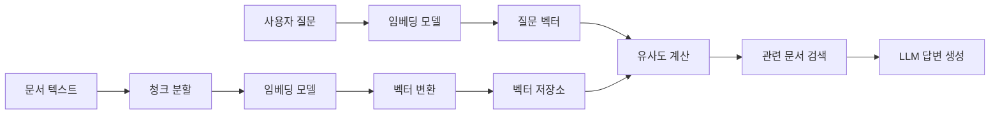

# RAG에서의 임베딩(Embedding)

## 개요

임베딩(Embedding)은 RAG(Retrieval-Augmented Generation) 시스템에서 텍스트를 벡터 공간으로 변환하여 의미적 유사성을 계산할 수 있게 하는 핵심 기술이다. 임베딩을 통해 컴퓨터(계산기)는 인간의 언어를 수치적으로 이해하고 처리할 수 있게 된다.

## RAG에서 임베딩이 필요한 이유

### 1. 의미적 검색의 구현

전통적인 키워드 기반 검색은 **정확한 단어 일치**에만 의존한다. 하지만 임베딩을 사용하면 **의미적으로 유사한 내용**을 찾을 수 있다.

**예시:**

- 사용자 질문: "자동차 연비를 높이는 방법"
- 키워드 검색: "연비"라는 단어가 포함된 문서만 검색
- 임베딩 검색: "연료 효율성", "기름값 절약", "경제적 운전" 등 의미적으로 관련된 내용도 검색

### 2. 다국어 및 동의어 처리

임베딩은 서로 다른 표현이지만 같은 의미를 가진 텍스트들을 유사한 벡터 공간에 배치한다.

**예시:**

- "큰", "거대한", "대형의" → 유사한 벡터값
- "happy", "기쁜", "즐거운" → 유사한 벡터값

### 3. 컨텍스트 이해

단어의 문맥적 의미를 파악하여 더 정확한 검색 결과를 제공한다.

**예시:**

- "사과를 먹다" (과일)
- "선생님께 사과하다" (사죄)
  → 같은 "사과"이지만 다른 벡터값을 가짐

## 임베딩의 작동 원리

### 1. 벡터 변환 과정

```
텍스트 → 토큰화 → 임베딩 모델 → 벡터 (숫자 배열)

예시:
"안녕하세요" → [0.2, -0.1, 0.8, 0.3, -0.5, ...]
```

### 2. 벡터 공간에서의 유사성 계산

임베딩된 벡터들은 고차원 공간에서 의미적으로 유사한 텍스트끼리 가까이 위치한다.

```
코사인 유사도 = (벡터A · 벡터B) / (|벡터A| × |벡터B|)

결과값:
- 1에 가까울수록: 매우 유사
- 0에 가까울수록: 관련성 낮음
- -1에 가까울수록: 반대 의미
```

### 3. RAG에서의 임베딩 활용 과정



## 대표적인 임베딩 모델

### 상용 임베딩 모델

#### 1. OpenAI 임베딩 모델

OpenAI의 임베딩 모델은 다양한 도메인에서 검증된 안정적인 성능을 제공한다. 안정성과 범용성의 대명사로 불리며, 다수의 기업에서 프로덕션 환경에 도입하고 있다.

**주요 모델:**

- `text-embedding-ada-002` (1,536차원): 레거시 모델이지만 여전히 안정적이다
- `text-embedding-3-small` (1,536차원): 비용 효율적인 최신 모델이다
- `text-embedding-3-large` (3,072차원): 최고 성능 모델이다

**핵심 특징:**

- **차원 조정**: `dimensions` 파라미터로 벡터 차원 최적화가 가능하다
- **검증된 성능**: 다양한 산업군에서 검증된 안정적인 품질을 보장한다
- **지속적 업데이트**: 2024년 3월 출시된 v3 모델이 현재 주력이다

**비용 및 라이선스:**

- 사용량 기반 과금 방식이며 API 호출당 비용이 발생한다
- OpenAI 이용 약관 및 정책 준수가 필요하다
- 상업적 사용이 가능하며 별도 계약 조건이 적용된다

#### 2. Google Gemini 임베딩 모델

Google의 Gemini 임베딩은 2025년 현재 무료 티어에서 가장 관대한 사용 한도를 제공하며, 중소기업과 개발자들에게 최고의 가치를 제공하고 있다.

**최신 업데이트 (2025년):**

- **2025년 3월**: Gemini API에서 실험적 출시되었다
- **2025년 7월**: 정식 출시(GA)가 완료되었다
- **신규 모델**: text-embedding-005, text-multilingual-embedding-002가 추가되었다

**핵심 특징:**

- **다국어 지원**: 100개 이상 언어를 지원한다
- **긴 컨텍스트**: 최대 2,048 토큰 입력을 지원한다
- **차원 조정**: MRL 기술로 3,072 → 1,536 / 768차원 조정이 가능하다
- **MTEB 성능**: Multilingual 리더보드에서 평균 68.32점을 기록했다

**비용 및 라이선스:**

- 업계 최고 수준의 관대한 무료 사용량을 제공한다
- Google Cloud Vertex AI 또는 Gemini API를 통해 제공된다
- 상업적 사용이 가능하다

### 오픈소스 임베딩 모델

#### 1. Sentence-BERT (SBERT)

BERT 기반의 검증된 문장 임베딩 모델로, 다양한 크기와 성능의 모델을 제공한다. 입문자부터 전문가까지 폭넓은 사용자층을 보유하고 있다.

**추천 모델:**

- `all-MiniLM-L6-v2`: 384차원의 경량화된 고속 모델이다
- `all-mpnet-base-v2`: 768차원으로 성능과 속도의 균형을 제공한다

**주요 장점:**

- 풍부한 사전 훈련된 모델을 제공한다
- 활발한 커뮤니티 지원이 있다
- 상세한 문서화가 되어 있다

**라이선스:** Apache License 2.0을 따르며 상업적 사용이 자유롭다

#### 2. BGE (BAAI General Embedding)

중국 BAAI에서 개발한 최첨단 임베딩 모델로, 특히 BGE-M3는 다기능성에서 독보적인 성능을 보인다. 고성능 범용 임베딩의 강자로 평가받고 있다.

**주요 모델:**

- `bge-base-en-v1.5`: 768차원의 영어 특화 모델이다
- `bge-large-en-v1.5`: 1,024차원의 고성능 영어 모델이다
- **`bge-m3`**: 혁신적인 다기능 모델이다

**BGE-M3 특별 기능:**

- **다국어**: 100개 이상 언어를 지원한다
- **장문 처리**: 최대 8,192 토큰을 처리할 수 있다
- **다중 검색**: 밀집·희소·다중벡터 검색을 동시에 지원한다

**라이선스:** Apache License 2.0 또는 MIT 라이선스로 배포되어 상업적 사용이 가능하다

#### 3. E5 (Text Embeddings by Weakly-Supervised Contrastive Pre-training)

Microsoft에서 개발한 임베딩 모델로, Weakly-supervised contrastive learning 기반의 혁신적인 접근법을 사용한다.

**핵심 특징:**

- Zero-shot 및 fine-tuned 환경에서 우수한 성능을 보인다
- `mE5` 시리즈는 다국어 및 instruction-tuned 버전을 포함한다
- 최신 연구 결과를 반영한 고성능 모델이다

**라이선스:** Apache License 2.0을 채택하여 상업적 사용이 자유롭다

### 한국어 특화 임베딩 모델

한국어 텍스트에 대해 높은 성능을 제공하는 전용 모델들이다. 도메인 맞춤형 서비스에 유리하며, 최근 기준으로 성능이 크게 향상되었다.

#### 1. 주요 한국어 모델

**BGE-M3 기반 한국어 모델:**

- **`dragonkue/BGE-m3-ko`**: 1,024차원이며, 최대 8,192 토큰을 지원한다. 성능 지표에서 KoE5보다 우수한 결과를 보인다
- **`upskyy/bge-m3-korean`**: KorSTS/KorNLI 기반으로 fine-tune되어 준수한 성능을 제공한다

**기타 한국어 모델:**

- **KoSentenceBERT**: 한국어 문장 임베딩의 기본 모델이다
- **KoBERT 기반 모델**: 다양한 한국어 도메인별 특화 모델이 제공된다
- **KURE-v1**: 고려대에서 개발한 모델로, BGE-M3-KO와 근접한 성능으로 리더보드 상위권을 차지하고 있다

#### 2. 라이선스 정보

**한국어 모델 라이선스:**

- **KoBERT 기반 모델**: 일반적으로 Apache License 2.0을 따른다
- **ko-sentence-transformers 모델**: 프로젝트에 따라 Apache License 2.0 또는 CC-BY-SA-4.0 라이선스가 적용될 수 있다
- **BGE 기반 한국어 모델**: 원본 BGE 모델의 라이선스(Apache 2.0, MIT)를 따른다

**주의사항:** 실제 사용 전에는 각 모델의 최신 라이선스 조건을 직접 확인하는 것이 중요하다. AI 모델의 라이선스 정책은 변경될 수 있으므로 정기적인 확인이 필요하다.

## 임베딩 모델 선택 기준

### 1. 성능 vs 비용

- **상용 모델**: 높은 성능, API 비용 발생
- **오픈소스 모델**: 무료 사용, 로컬 리소스 필요

### 2. 언어 지원

- **다국어 모델**: 여러 언어 동시 지원
- **특화 모델**: 특정 언어에 최적화

### 3. 벡터 차원

- **고차원**: 더 정확한 의미 표현, 더 많은 저장 공간 필요
- **저차원**: 빠른 처리 속도, 적은 저장 공간

### 4. 도메인 특화

- **범용 모델**: 일반적인 텍스트에 적합
- **도메인 특화 모델**: 의료, 법률, 기술 등 특정 분야에 최적화

## 임베딩 성능 평가 지표

### 1. 검색 정확도 (Retrieval Accuracy)

관련 문서를 얼마나 정확하게 찾아내는지를 측정하는 지표이다.

### 2. 의미적 유사성 (Semantic Similarity)

인간이 판단하는 의미적 유사성과 모델이 계산하는 유사성의 일치도를 측정하는 지표이다.

### 3. 처리 속도 (Processing Speed)

텍스트를 벡터로 변환하는 속도를 측정하는 지표이다.

### 4. 메모리 사용량 (Memory Usage)

모델 실행에 필요한 메모리 크기를 측정하는 지표이다.

## 2025년 임베딩 모델 선택 가이드

### 비용 효율성 기준

1. **무료 사용 우선**: Google Gemini (가장 관대한 무료 티어)
2. **소규모 프로젝트**: 오픈소스 모델 (SBERT, BGE)
3. **대규모 상용 서비스**: OpenAI 또는 유료 Gemini

### 성능 기준

1. **최고 성능**: OpenAI text-embedding-3-large
2. **균형잡힌 성능**: Google Gemini 최신 모델
3. **특화 성능**: BGE-M3 (다기능), 한국어 특화 모델

### 기술적 요구사항 기준

- **다국어 지원**: Gemini, BGE-M3
- **긴 텍스트**: BGE-M3 (8,192 토큰)
- **온프레미스 배포**: 오픈소스 모델
- **한국어 특화**: BGE-M3-KO, KURE-v1

## 실제 구현 시 고려사항

### 1. 청크 크기 최적화

임베딩할 텍스트 청크의 크기가 검색 성능에 큰 영향을 미친다.

### 2. 벡터 저장소 선택

좋아요. 최신 동향과 조건부 표현을 반영해서 표를 다시 작성해 드릴게요.

---

| 벡터 저장소  | 내용                                                        | 장점                                                                                                                                                     | 단점                                                                                                                                                                  |
| ------------ | ----------------------------------------------------------- | -------------------------------------------------------------------------------------------------------------------------------------------------------- | --------------------------------------------------------------------------------------------------------------------------------------------------------------------- |
| **FAISS**    | Facebook AI Research에서 개발한 고성능 벡터 검색 라이브러리 | • 매우 빠른 검색 속도<br>• 대용량 데이터 처리 가능<br>• 다양한 인덱스 알고리즘 및 GPU 가속 지원                                                          | • 대규모 서비스 통합 시 인덱스·메모리·GPU 최적화 설정이 복잡해질 수 있음<br>• 기본적으로 분산 클러스터 지원은 없음(멀티 GPU·샤딩 가능)<br>• 메타데이터 관리 기능 부족 |
| **Chroma**   | 오픈소스 임베딩 데이터베이스                                | • 간단하고 직관적인 API<br>• 메타데이터 필터링 지원<br>• Python/JavaScript SDK 제공<br>• 로컬·클라우드 환경 모두 지원                                    | • 대규모 데이터셋에서는 FAISS나 Milvus 대비 검색 성능이 떨어질 수 있음<br>• 프로덕션 환경에서의 장기 안정성 검증 부족                                                 |
| **Pinecone** | 클라우드 기반 완전 관리형 벡터 데이터베이스                 | • 자동 스케일링 및 관리형 서비스<br>• 높은 가용성과 안정성<br>• 강력한 메타데이터 기반 검색<br>• 인덱스 최적화 자동 처리                                 | • 사용량 기반 과금 구조<br>• 네트워크 지연에 따라 성능 영향 가능<br>• 온프레미스 배포 불가                                                                            |
| **PGVector** | PostgreSQL 확장 기반 벡터 데이터베이스                      | • 기존 PostgreSQL 인프라 재사용 가능<br>• SQL과 벡터 검색 결합 가능<br>• 트랜잭션 및 관계형 기능 활용 가능<br>• 최근 HNSW 인덱스 지원으로 검색 성능 개선 | • 순수 벡터 DB 대비 대규모 처리 성능은 다소 제한적<br>• 복잡한 벡터 연산 지원은 제한됨<br>• PostgreSQL 운용 경험이 필요                                               |

### 3. 하이브리드 검색

키워드 검색과 벡터 검색을 결합하여 더 나은 결과를 얻을 수 있다.

## 벡터 저장소 선택 가이드

### 환경별 추천

#### 1. 온프레미스 환경

- **대규모 (>1,000만 벡터)**
  **FAISS** – 최고 수준의 검색 성능과 GPU 가속 지원.
  _(단, 분산·확장 처리는 직접 구현 필요)_
- **중규모 (100만\~1,000만 벡터)**
  **PGVector** – 기존 PostgreSQL 인프라 활용, HNSW 인덱스 지원으로 성능 향상.
  **FAISS** – 순수 검색 성능 우위.
- **소규모 (<100만 벡터)**
  **Chroma** – 간단한 설치와 개발 편의성, 빠른 프로토타입 제작에 적합.
  _(장기 저장 시 외부 스토리지 연동 필요)_

#### 2. 웹 애플리케이션 백엔드

- **기존 DB 통합·트랜잭션 필요 시**
  **PGVector** – SQL과 벡터 검색 결합 가능, 안정적인 운영.
  _(초대규모에서는 인덱스 업데이트 최적화 필요)_
- **빠른 개발·시제품 제작**
  **Chroma** – REST API, Docker 지원, 간단한 설정.
- **클라우드 사용 가능 시**
  **Pinecone** – 완전 관리형, 자동 스케일링, 강력한 메타데이터 검색.
  _(네트워크 지연·클라우드 종속성 고려)_

#### 3. 로컬 개발 환경

- **프로토타이핑·소규모 실험**
  **Chroma** – 설치 간단, 빠른 테스트 가능.
- **성능 검증·알고리즘 비교**
  **FAISS** – 실제 운영 환경과 유사한 검색 성능 측정 가능.

### 종합 비교

| 기준            | 순위 (일반적 경향)                                           |
| --------------- | ------------------------------------------------------------ |
| **운영 복잡도** | Chroma < PGVector < FAISS                                    |
| **검색 성능**   | FAISS > PGVector(최근 개선) > Chroma                         |
| **개발 속도**   | Chroma > PGVector(기존 DB 환경 시 PGVector ≥ Chroma) > FAISS |

### 온프레미스 vs 로컬 환경

- **온프레미스**: 기업/조직의 자체 인프라(데이터센터, 사내 서버, 프라이빗 클라우드 VM 포함)
- **로컬 환경**: 개발자 개인 PC 또는 노트북에서의 개발·테스트 환경
- 일반적으로 **개발 단계**에서는 로컬, **운영 단계**에서는 온프레미스를 주로 사용.

## 결론

임베딩은 RAG 시스템에서 텍스트의 의미를 수치적으로 표현하여 효과적인 정보 검색을 가능하게 하는 핵심 기술이다. 적절한 임베딩 모델 선택과 최적화를 통해 RAG 시스템의 성능을 크게 향상시킬 수 있다. 프로젝트의 요구사항, 예산, 언어, 도메인 등을 종합적으로 고려하여 최적의 임베딩 모델을 선택하는 것이 중요하다.
