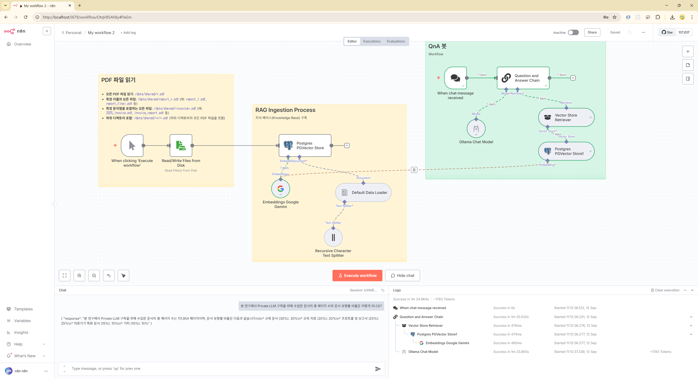
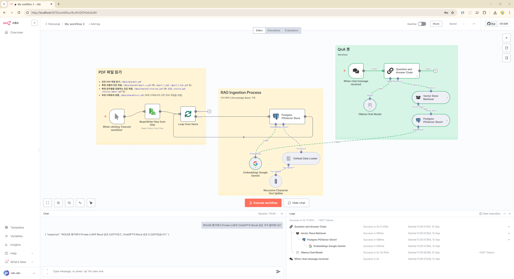
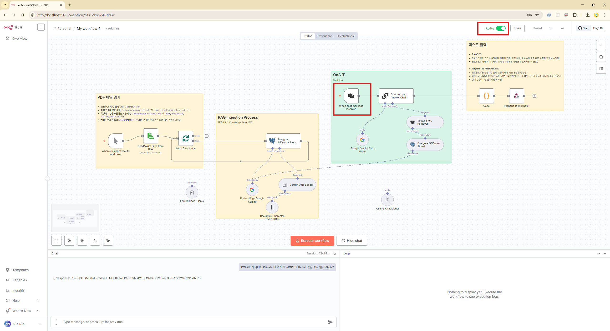
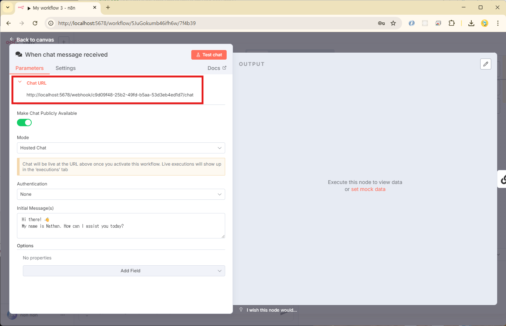
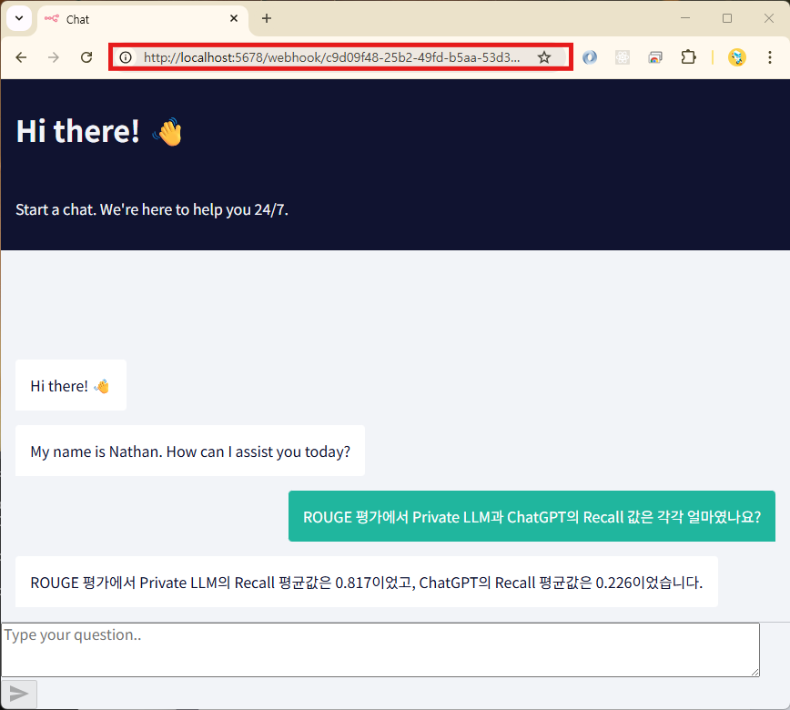

### 1. PDF RAG

#### 주요 노드

- Ollama Chat Model
- PGVector
- Embeddings Google Gemini

#### 테스트 질문

본 연구에서 Private LLM 구축을 위해 수집한 문서의 총 페이지 수와 문서 유형별 비율은 어떻게 되나요?

### 2. PDF RAG(여러 PDF 임베딩)

#### 테스트 질문

ROUGE 평가에서 Private LLM과 ChatGPT의 Recall 값은 각각 얼마였나요?

### 3. 챗봇 서비스

#### 1단계

- `Active` 활성화
- `When chat message received` 노드 더블 클릭!

#### 2단계

- `Chat URL` 복사

#### 3단계

- 복사한 `Chat URL` 브라우저에서 사용

