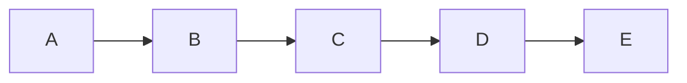
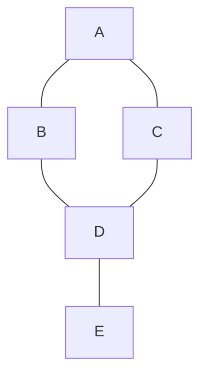

## LangGraph

LangGraph는 **그래프 자료구조**를 활용하여 복잡한 LLM(대규모 언어 모델) 애플리케이션의 워크플로우를 구축하는 프레임워크이다.

### 1. 핵심 특징

- **그래프 자료구조**: 노드와 에지로 구성된 자료구조이다.
- **노드(Node)**: LangGraph에서 특정 연산을 수행하는 단위(예: LLM 호출, 도구 사용 등).
- **에지(Edge)**: 노드와 노드 사이의 연결로, 제어 흐름의 경로를 나타낸다.
- **방향 그래프(Directed Graph)**: 에지에 방향성이 있어 흐름이 한쪽으로만 진행되는 그래프. LangGraph의 기본 구조이다.
- **순환(Cycle)**: LangGraph가 DAG(순환이 없는 방향 그래프)와 차별화되는 지점으로, 노드들이 반복적으로 순환하며 복잡한 로직을 구현하게 해준다.

### 2. 체인, 트리, 그래프 비교

#### 체인

#### 그래프

### 3. 상태

- LangGraph의 상태는 그래프 실행 과정에서 관리되며, 각 노드에서 읽고 쓸 수 있는 데이터이다.
- `TypedDict`나 `Pydantic` 모델을 사용하여 정의되며, 이를 통해 타입 안정성을 보장한다.
- LangGraph와 회사 결재 시스템 비유

  | 요소            | 회사 비유                        | 설명                                                                                                                                                |
  | :-------------- | :------------------------------- | :-------------------------------------------------------------------------------------------------------------------------------------------------- |
  | **상태(State)** | **결재 문서**                    | 그래프의 모든 노드가 공유하고 읽고 쓰는 데이터로, 문서의 내용과 같다.                                                                               |
  | **노드(Node)**  | **결재 단계 (사원, 대리, 과장)** | 특정 작업을 수행하는 단위이다. 결재 단계별로 서명, 내용 확인 등의 작업을 한다.                                                                      |
  | **엣지(Edge)**  | **결재 전달**                    | 노드 간의 흐름을 정의한다. 문서가 다음 결재 단계로 넘어가는 과정이다.                                                                               |
  | **조건부 엣지** | **결재 승인/반려**               | 문서의 상태에 따라 다음 단계가 결정된다. 문서가 완벽하면 승인(다음 단계로), 미비하면 반려(되돌려보냄)된다.                                          |
  | **순환(Cycle)** | **반려 후 재작업**               | 결재가 반려되었을 때, 문서를 수정하여 다시 올리는 반복적인 과정이다. LangGraph가 만족스러운 결과를 얻을 때까지 특정 노드를 반복 실행하는 것과 같다. |
