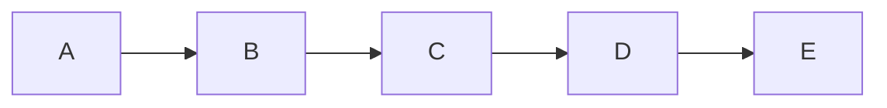
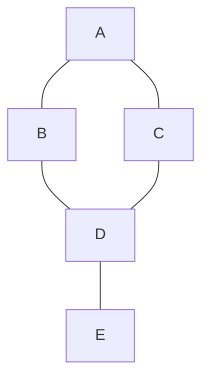

## LangGraph

LangGraph는 **그래프 자료구조**를 활용하여 복잡한 LLM(대규모 언어 모델) 애플리케이션의 워크플로우를 구축하는 프레임워크이다.

### 1. 핵심 특징

- **그래프 자료구조**: 노드와 에지로 구성된 자료구조이다.
- **노드(Node)**: LangGraph에서 특정 연산을 수행하는 단위(예: LLM 호출, 도구 사용 등).
- **에지(Edge)**: 노드와 노드 사이의 연결로, 제어 흐름의 경로를 나타낸다.
- **방향 그래프(Directed Graph)**: 에지에 방향성이 있어 흐름이 한쪽으로만 진행되는 그래프. LangGraph의 기본 구조이다.
- **순환(Cycle)**: LangGraph가 DAG(순환이 없는 방향 그래프)와 차별화되는 지점으로, 노드들이 반복적으로 순환하며 복잡한 로직을 구현하게 해준다.

### 2. 체인, 트리, 그래프 비교

#### 체인



#### 그래프



### 3. 상태

- LangGraph의 상태는 그래프 실행 과정에서 관리되며, 각 노드에서 읽고 쓸 수 있는 데이터이다.
- `TypedDict`나 `Pydantic` 모델을 사용하여 정의되며, 이를 통해 타입 안정성을 보장한다.
- LangGraph와 회사 결재 시스템 비유

  | 요소            | 회사 비유                        | 설명                                                                                                                                                |
  | :-------------- | :------------------------------- | :-------------------------------------------------------------------------------------------------------------------------------------------------- |
  | **상태(State)** | **결재 문서**                    | 그래프의 모든 노드가 공유하고 읽고 쓰는 데이터로, 문서의 내용과 같다.                                                                               |
  | **노드(Node)**  | **결재 단계 (사원, 대리, 과장)** | 특정 작업을 수행하는 단위이다. 결재 단계별로 서명, 내용 확인 등의 작업을 한다.                                                                      |
  | **엣지(Edge)**  | **결재 전달**                    | 노드 간의 흐름을 정의한다. 문서가 다음 결재 단계로 넘어가는 과정이다.                                                                               |
  | **조건부 엣지** | **결재 승인/반려**               | 문서의 상태에 따라 다음 단계가 결정된다. 문서가 완벽하면 승인(다음 단계로), 미비하면 반려(되돌려보냄)된다.                                          |
  | **순환(Cycle)** | **반려 후 재작업**               | 결재가 반려되었을 때, 문서를 수정하여 다시 올리는 반복적인 과정이다. LangGraph가 만족스러운 결과를 얻을 때까지 특정 노드를 반복 실행하는 것과 같다. |

---

## LangChain 그래프 시각화 오류 해결 방법

LangChain에서 그래프를 시각화할 때, 보통 아래와 같이 코드를 실행한다.

```python
from IPython.display import display, Image
display(Image(graph.get_graph().draw_mermaid_png()))
```

하지만 이 방식은 내부적으로 mermaid.ink API를 호출하기 때문에, 간헐적으로 500 오류 등 외부 API 문제로 인해 다음과 같은 ValueError가 발생할 수 있다.

```
ValueError: Failed to reach https://mermaid.ink/ API while trying to render your graph. Status code: 500.
...
```

이 문제를 피하기 위해 `draw_mermaid_png(draw_method=MermaidDrawMethod.PYPPETEER)` 옵션을 사용해 로컬에서 직접 렌더링을 시도하면, 또 다른 오류(`OSError`, `RuntimeError`)가 발생할 수 있다. 이 글에서는 이러한 오류의 원인과, 로컬 렌더링(PYPPETEER) 환경에서 발생하는 문제를 단계별로 해결하는 방법을 설명한다.

---

### 1\. 문제 분석: 복합적인 오류의 원인

LangChain의 `draw_mermaid_png()` 함수는 기본적으로 외부 API(`MermaidDrawMethod.API`)를 사용하거나, 로컬에서 `pyppeteer`를 사용하여 그래프를 렌더링한다. 그러나 두 방식 모두 다음과 같은 문제점을 내포하고 있다.

- **`MermaidDrawMethod.API` 오류:** `https://mermaid.ink` API 서버가 불안정하거나 접속할 수 없을 때 `ValueError`가 발생한다.
- **`MermaidDrawMethod.PYPPETEER` 오류:** 이 방식은 `pyppeteer`를 사용한다. `pyppeteer`는 내부적으로 **Chromium 브라우저**에 의존한다. 여기서 두 가지 주요 오류가 발생한다.
  - **Chromium 다운로드 오류 (`OSError`):** `pyppeteer`가 특정 버전의 Chromium을 다운로드하려 하지만, 해당 URL에 파일이 없어서 발생한다. 이는 `pyppeteer`가 최신 버전의 Chromium을 자동으로 참조하지 못하기 때문에 발생한다.
  - **비동기 이벤트 루프 오류 (`RuntimeError`):** Jupyter Notebook과 같은 환경은 이미 비동기 이벤트 루프가 실행 중이다. 이때 `pyppeteer`가 내부적으로 `asyncio.run()`을 호출하면, 이벤트 루프가 중첩되어 `RuntimeError`가 발생한다.

이러한 문제들은 단순히 한두 가지 설정을 변경하는 것으로는 해결되지 않으며, **두 가지 오류를 모두 해결하는 복합적인 접근이 필요하다.**

---

### 2\. 해결 방법: 두 가지 문제에 대한 동시 해결

#### **1단계: 비동기 이벤트 루프 충돌 해결**

먼저 `RuntimeError`를 해결해야 한다. `nest_asyncio` 라이브러리를 사용하면 이미 실행 중인 이벤트 루프 내에서 새로운 이벤트 루프를 시작할 수 있게 되어 이 문제를 해결할 수 있다.

1.  **`nest_asyncio` 설치:**

    ```bash
    pip install nest_asyncio
    ```

2.  **`nest_asyncio` 적용:**

    코드를 실행하기 전에 `nest_asyncio.apply()`를 호출한다.

    ```python
    import nest_asyncio
    nest_asyncio.apply()

    # ... 나머지 코드
    ```

#### **2단계: Pyppeteer Chromium 다운로드 오류 해결**

다음으로 `OSError`를 해결해야 한다. `pyppeteer`가 Chromium을 다운로드하지 않고, 사용자의 시스템에 이미 설치된 **Chrome 또는 Edge 브라우저를 사용하도록** 강제하는 방법이다.

`pyppeteer`는 환경 변수 설정만으로는 내부 다운로드 로직을 건너뛰지 못한다. 따라서 `langchain_core` 라이브러리의 소스 코드를 직접 수정해야 한다.

1.  **`graph_mermaid.py` 파일 찾기:**

    `langchain_core` 라이브러리가 설치된 경로에서 `graph_mermaid.py` 파일을 찾는다.

    ```
    예시 경로: [venv 경로]\Lib\site-packages\langchain_core\runnables\graph_mermaid.py
    ```

2.  **`_render_mermaid_using_pyppeteer` 함수 수정:**

    파일을 열고 `_render_mermaid_using_pyppeteer` 함수 내부에 있는 `pyppeteer.launch()` 호출 부분을 찾아 `executablePath` 인자를 추가한다.

    ```python
    # 기존 코드
    # browser = await launch()

    # 수정 코드
    # Windows 환경 예시
    browser = await launch(executablePath=r'C:\Program Files\Google\Chrome\Application\chrome.exe')
    # macOS 환경 예시
    # browser = await launch(executablePath='/Applications/Google Chrome.app/Contents/MacOS/Google Chrome')
    ```

    **크롬 실행 파일 경로**를 정확하게 지정해야 한다.

---

### 3. 최종 코드

위 두 가지 해결책을 모두 적용하면 LangChain의 그래프 시각화 오류를 안정적으로 해결할 수 있다.

```python
import nest_asyncio
from IPython.display import display, Image
from langchain_core.runnables.graph_mermaid import MermaidDrawMethod

# 1. 비동기 이벤트 루프 중첩 오류 해결
nest_asyncio.apply()

# 2. (라이브러리 파일 수정 후) 그래프 시각화
display(Image(graph.get_graph().draw_mermaid_png(draw_method=MermaidDrawMethod.PYPPETEER)))
```

이 방법은 라이브러리 소스 코드를 직접 수정하기 때문에, 라이브러리를 업데이트할 때마다 동일한 수정을 다시 적용해야 하는 번거로움이 있다. 하지만 현재 시점에서 가장 확실하게 문제를 해결하고 그래프를 성공적으로 렌더링할 수 있는 방법이다.
