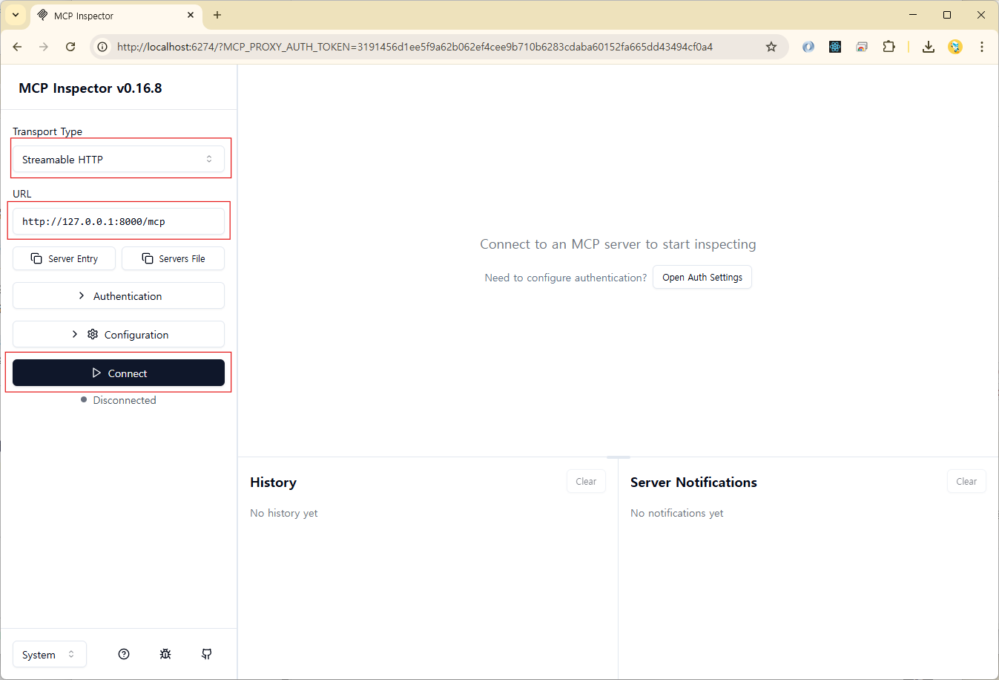

# MCP(Model Context Protocol)

> 공식 문서: <https://modelcontextprotocol.io/docs/getting-started/intro>

MCP는 AI 모델이 외부 시스템과 소통하고 최신 정보나 도구를 활용할 수 있도록 돕는 개방형 표준 프로토콜이다. MCP를 이용하면 LangChain, LlamaIndex, CrewAI 같은 프레임워크와 관계없이 LLM(거대 언어 모델)이 다양한 외부 도구에 접근할 수 있게 된다.

---

## **핵심 구성 요소**

- **MCP 호스트**: Claude Desktop, IDE와 같은 AI 애플리케이션이다. 이는 하나 이상의 MCP 클라이언트를 조정하고 관리하는 역할을 한다.
- **MCP 클라이언트**: 호스트 애플리케이션 내부에 내장된 경량 구성 요소이다. 각 MCP 서버와 일대일 연결을 유지하며, 서버로부터 컨텍스트를 얻어 호스트에 제공한다.
- **MCP 서버**: 로컬 또는 원격으로 실행되는 독립적인 프로그램이다. 파일, 데이터베이스, API 등으로부터 컨텍스트를 제공하거나 특정 작업을 수행하는 기능을 노출한다.

---

## **주요 기능**

- **도구(Tools)**: 언어 모델이 호출하여 특정 작업을 수행하는 함수 (예: 이메일 전송, 주식 정보 조회)
- **리소스(Resources)**: 언어 모델이 읽고 활용할 수 있는 데이터 소스 (예: 웹 페이지 내용, 문서 파일)
- **프롬프트(Prompts)**: 언어 모델과의 상호 작용을 구조화하는 데 도움이 되는 재사용 가능한 템플릿

---

## **작동 방식**

MCP의 작동 방식은 **호스트-클라이언트-서버** 모델을 따른다.

1.  **호스트**는 특정 작업을 수행하기 위해 **클라이언트**를 통해 **서버**에 요청을 보낸다.
2.  **클라이언트**는 서버와 통신하며 데이터를 주고받는다.
3.  **서버**는 요청에 따라 도구를 실행하거나 리소스를 조회한 뒤, 그 결과를 클라이언트를 통해 다시 호스트에 전달한다.

---

## **MCP 서버**

### 1. FastMCP 설치

> 공식 문서: <https://github.com/jlowin/fastmcp?tab=readme-ov-file#installation>

```bash
uv add fastmcp
```

### 2. MCP 서버 구동

```bash
# MCP 서버 코드에서 `mcp.run(transport="streamable-http")`를 호출하는 경우
uv run <python_file_name>

# MCP 서버 코드에서 `mcp.run(transport="streamable-http")`를 호출하지 않는 경우
fastmcp run <python_file_name>
```

### 3. MCP Inspector (MCP Server 테스트)

#### 1) 구동 방법

> 공식 문서: <https://modelcontextprotocol.io/docs/tools/inspector>

```bash
npx @modelcontextprotocol/inspector
```

#### 2) 설정 및 사용법

1. 첫 화면에서 주요 설정

   - **Transport Type**: Streamable HTTP
   - **URL**: http://127.0.0.1:8000/mcp

     ⚠️ `http://localhost:8000/mcp`로 설정하면 연결 안됨

   

2. Resources 확인

   

3. Tools 테스트

   
