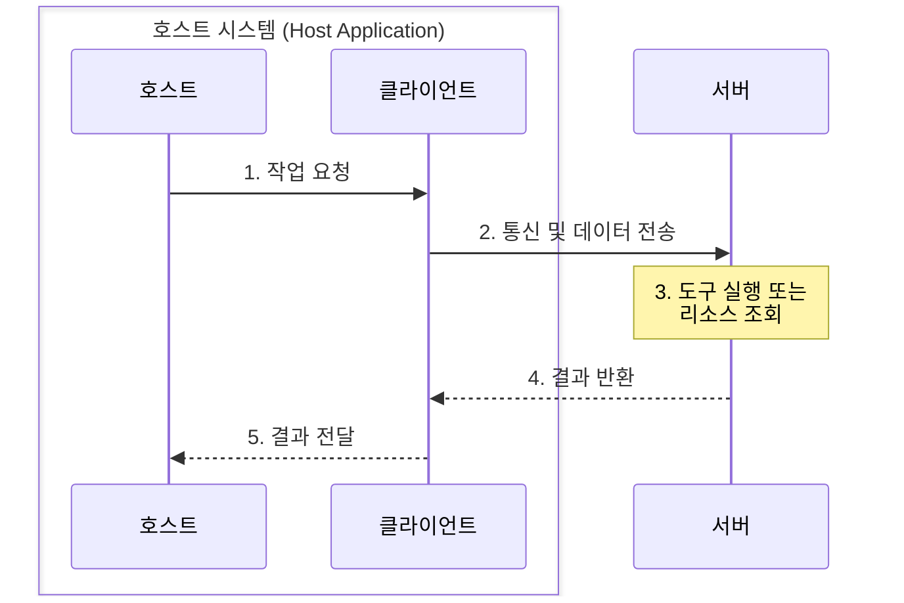
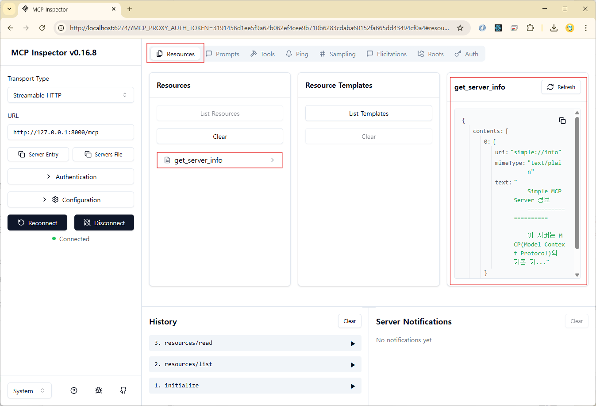
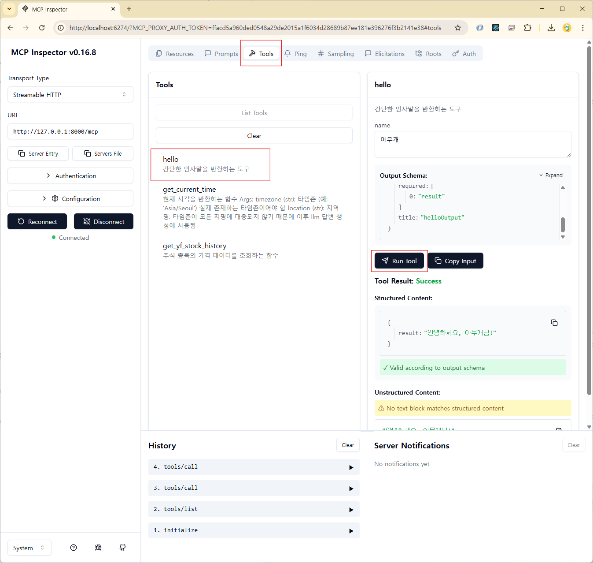

# MCP(Model Context Protocol)

> 공식 문서: <https://modelcontextprotocol.io/docs/getting-started/intro>

MCP는 AI 모델이 외부 시스템과 소통하고 최신 정보나 도구를 활용할 수 있도록 돕는 개방형 표준 프로토콜이다. MCP를 이용하면 LangChain, LlamaIndex, CrewAI 같은 프레임워크와 관계없이 LLM(거대 언어 모델)이 다양한 외부 도구에 접근할 수 있게 된다.

---

## **핵심 구성 요소**

- **MCP 호스트**: Claude Desktop, IDE와 같은 AI 애플리케이션이다. 이는 하나 이상의 MCP 클라이언트를 조정하고 관리하는 역할을 한다.
- **MCP 클라이언트**: 호스트 애플리케이션 내부에 내장된 경량 구성 요소이다. 각 MCP 서버와 일대일 연결을 유지하며, 서버로부터 컨텍스트를 얻어 호스트에 제공한다.
- **MCP 서버**: 로컬 또는 원격으로 실행되는 독립적인 프로그램이다. 파일, 데이터베이스, API 등으로부터 컨텍스트를 제공하거나 특정 작업을 수행하는 기능을 노출한다.

---

## **주요 기능**

- **도구(Tools)**: 언어 모델이 호출하여 특정 작업을 수행하는 함수 (예: 이메일 전송, 주식 정보 조회)
- **리소스(Resources)**: 언어 모델이 읽고 활용할 수 있는 데이터 소스 (예: 웹 페이지 내용, 문서 파일)
- **프롬프트(Prompts)**: 언어 모델과의 상호 작용을 구조화하는 데 도움이 되는 재사용 가능한 템플릿

---

## **작동 방식**

MCP의 작동 방식은 **호스트-클라이언트-서버** 모델을 따른다.

1.  **호스트**는 특정 작업을 수행하기 위해 **클라이언트**를 통해 **서버**에 요청을 보낸다.
2.  **클라이언트**는 서버와 통신하며 데이터를 주고받는다.
3.  **서버**는 요청에 따라 도구를 실행하거나 리소스를 조회한 뒤, 그 결과를 클라이언트를 통해 다시 호스트에 전달한다.



---

## **MCP 서버**

### 1. FastMCP 설치

> 공식 문서: <https://github.com/jlowin/fastmcp?tab=readme-ov-file#installation>

```bash
uv add fastmcp
```

### 2. MCP 서버 구동 및 전송 방식(Transport) 비교

MCP 서버는 클라이언트와의 통신을 위해 두 가지 주요 전송(Transport) 방식을 지원합니다.

#### 1) 전송 방식별 구동 방법

##### (1) stdio (표준 입출력) 방식
로컬 환경의 클라이언트(예: Claude Desktop, Cursor 등)가 백그라운드에서 서버 프로세스를 직접 구동하고 표준 입력(stdin)과 표준 출력(stdout)을 연결하여 통신하는 방식입니다.

* **CLI 명령어 실행**
  ```bash
  uv run fastmcp run mcp_server.py:mcp
  ```
* **Python 코드 실행 (`if __name__ == "__main__":` 블록)**
  ```python
  if __name__ == "__main__":
      # 기본값이 stdio이므로 인수 없이 실행하거나 transport="stdio" 지정
      mcp.run(transport="stdio")
  ```
  실행: `uv run mcp_server.py`

##### (2) HTTP (SSE - Server-Sent Events) 방식
서버를 상시 실행하여 웹 API 형태로 특정 포트를 대기시키고, 외부나 원격의 클라이언트가 HTTP를 통해 접속할 수 있게 하는 방식입니다.

* **CLI 명령어 실행**
  ```bash
  uv run fastmcp run mcp_server.py:mcp --transport http --port 8000
  ```
* **Python 코드 실행 (`if __name__ == "__main__":` 블록)**
  ```python
  if __name__ == "__main__":
      mcp.run(transport="sse", port=8000)
  ```
  실행: `uv run mcp_server.py`

---

#### 2) 전송 방식 비교 및 성능 분석

| 비교 항목 | stdio (표준 입출력) 방식 | HTTP (SSE) 방식 |
| :--- | :--- | :--- |
| **통신 방식** | 프로세스 간 통신 (IPC - 로컬 파이프 스트림) | TCP/IP 네트워크 통신 (HTTP/SSE) |
| **프로세스 관리** | **자동 관리 (Keep-Alive)**<br>클라이언트 실행 시 백그라운드에 최초 1회 자동으로 켜고, 종료 시 함께 꺼짐. | **수동 관리**<br>사용자나 시스템이 별도로 웹 서버를 구동하여 상시 가동(24시간 켜둠)해야 함. |
| **속도 (Latency)** | **매우 빠름**<br>네트워크 카드나 TCP 핸드셰이크를 거치지 않아 지연 시간이 극도로 짧음. | **상대적으로 느림**<br>로컬 루프백 혹은 네트워크 계층을 거치며 HTTP 헤더 오버헤드가 발생함. |
| **보안성** | **매우 높음**<br>로컬 시스템 내에서만 통신하여 외부 네트워크 노출이 전혀 없음. | **추가 보안 필요**<br>포트가 외부망에 노출되므로 인증 및 암호화(HTTPS) 처리가 필요함. |
| **주요 용도** | 개인 PC에서 Claude Desktop, IDE 등과 로컬 연동할 때 (기본값) | 사내 공용 도구 서버, 클라우드 환경 등 원격에서 다수의 클라이언트가 접속할 때 |

> [!TIP]
> **로컬 개발 및 개인용 AI 앱 연동 시**에는 성능(지연 시간)이 가장 빠르고 별도의 서버 관리 오버헤드가 없는 **`stdio` 방식이 가장 나은 선택**입니다.

### 3. MCP Inspector (MCP Server 테스트)

#### 1) 구동 방법

MCP 서버를 간편하게 시뮬레이션하고 테스트할 수 있도록 웹 브라우저 기반의 인스펙터(Inspector) UI를 띄우는 두 가지 방법이 있습니다.

##### (1) FastMCP 내장 Inspector (권장 - stdio 기반)
FastMCP 프레임워크가 제공하는 개발 전용 기능으로, 별도의 서버 실행 과정 없이 파일과 인스턴스 지정만으로 백그라운드 서버 구동 및 인스펙터 브라우저 연결을 동시에 자동 수행합니다.

* **실행 명령어**
  ```bash
  uv run fastmcp dev inspector mcp_server.py:mcp
  ```
  *실행 시 브라우저에서 자동으로 인스펙터 웹 페이지가 열리며, 로컬의 stdio 방식으로 연동됩니다.*

##### (2) 공식 npx Inspector (HTTP/SSE 기반)
Model Context Protocol 공식 진영에서 배포한 범용 인스펙터 툴입니다. 이미 구동 중인 로컬 또는 원격지의 HTTP/SSE 서버가 존재할 때 연결하여 테스트하는 방식입니다.

* **공식 문서**: <https://modelcontextprotocol.io/docs/tools/inspector>
* **실행 명령어**
  ```bash
  npx @modelcontextprotocol/inspector
  ```
  *명령어 실행 후 터미널에 나타나는 주소로 접속한 뒤, 아래의 수동 설정 과정을 통해 연결을 시도해야 합니다.*

#### 2) 설정 및 사용법 (공식 npx Inspector 사용 시)

1. 첫 화면에서 주요 설정

   - **Transport Type**: Streamable HTTP
   - **URL**: http://127.0.0.1:8000/mcp

     ⚠️ `http://localhost:8000/mcp`로 설정하면 연결 안됨

   

2. Resources 확인

   

3. Tools 테스트

   
