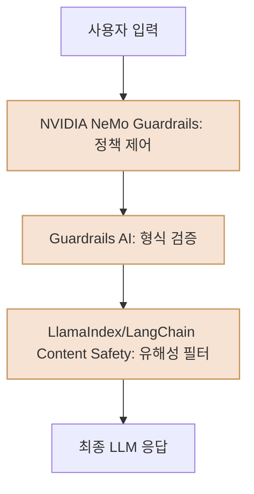

# 오픈소스 LLM 가드레일 프레임워크 및 바람직한 조합 활용 예시

## 주요 프레임워크 및 라이브러리 소개

### 1. **NVIDIA NeMo Guardrails**
- 규칙(YAML) 기반의 대화 흐름 및 정책 제어에 특화
- 특정 주제 응답 제한, 단계별 질문 강제, 외부 시스템 연동 등 기업 규범 준수에 유리

### 2. **Guardrails AI (Python 라이브러리)**
- LLM의 출력 포맷 검증(JSON, Pydantic)
- 데이터 타입 유효성, 신뢰 점수 등 구조적 안전성 보장
- API, 정보 추출, RAG 등 결과 형식이 중요한 환경에 효과적

### 3. **LlamaIndex Guardrails**
- 데이터 생성·처리 파이프라인 내 유해성 콘텐츠 방지
- 프롬프트·응답 수준 가드레일/민감 데이터 자동 필터링
- 기존 LlamaIndex 환경과 자연스럽게 통합 가능

### 4. **LangChain Content Safety**
- 다양한 콘텐츠 안전성 솔루션과 유연한 연동(예: Azure)
- 실시간 유해 콘텐츠 필터, 프롬프트·응답 단위 보안 강화
- LangChain 생태계와 쉽게 결합 가능

---

## 바람직한 조합 활용 예 (실무 권장 구조)

> 한 가지 프레임워크만으로 모든 보안/형식 검증 요구를 만족시키기 어렵다. 다음과 같이 목적별로 다중 가드레일을 순차 적용하는 것이 안전성·유연성 측면에서 가장 바람직하다.

### 단계별 역할
- **NeMo Guardrails**: 대화 흐름(Flow)과 정책(Policy) 기반으로 민감 토픽 접근 차단/사전 질문 강제 등 1차 통제
- **Guardrails AI**: LLM 응답의 구조·형식(JSON 등)과 신뢰도 검증
- **LlamaIndex/ LangChain Content Safety**: 최종 단계에서 외부 유해성/민감성 API, 프롬프트&응답 보안 검사

---

## 결론
- 복잡한 서비스는 위와 같이 단계별·역할별로 가드레일을 조합 적용하는 것이 가장 효과적임
- 프레임워크별 장점을 적극 활용하고, 서비스 상황에 맞게 유연하게 조합할 것을 권장함
