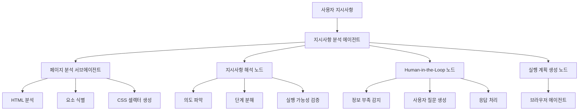
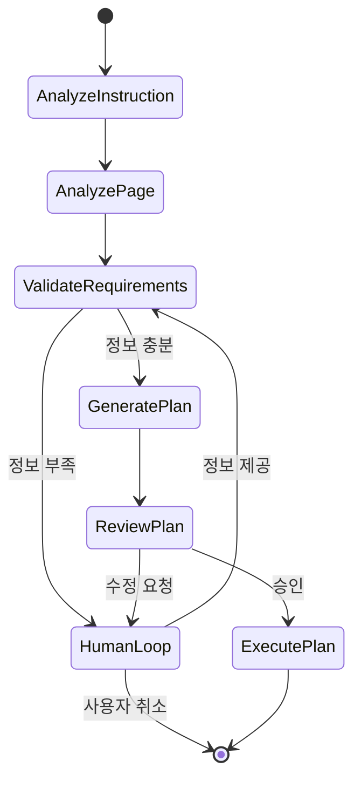

# Design Document

## Overview

지시사항 분석 에이전트는 사용자의 고수준 지시사항을 현재 웹페이지 컨텍스트에 맞는 구체적인 실행 단계로 변환하는 LangGraph 기반 에이전트입니다. 이 시스템은 페이지 분석, 지시사항 해석, Human-in-the-Loop 상호작용, 그리고 실행 계획 생성을 통합하여 브라우저 자동화의 정확성과 사용성을 크게 향상시킵니다.

## Architecture

### 시스템 구조



### 에이전트 워크플로우



## Components and Interfaces

### 1. InstructionAnalyzerState

```python
class InstructionAnalyzerState(TypedDict):
    # 입력 데이터
    user_instruction: str           # 사용자의 원본 지시사항
    html_content: str              # 현재 페이지 HTML
    current_url: str               # 현재 페이지 URL

    # 분석 결과
    parsed_intent: Optional[Dict]   # 파싱된 사용자 의도
    page_analysis: Optional[Dict]   # 페이지 분석 결과
    identified_elements: List[Dict] # 식별된 UI 요소들

    # 실행 계획
    execution_steps: List[Dict]     # 생성된 실행 단계들
    missing_info: List[str]         # 부족한 정보 목록
    user_questions: List[str]       # 사용자에게 할 질문들

    # 상태 관리
    current_step: int              # 현재 처리 중인 단계
    user_responses: Dict           # 사용자 응답들
    validation_errors: List[str]   # 검증 오류들
    is_approved: bool             # 사용자 승인 여부
```

### 2. InstructionAnalyzer 클래스

```python
class InstructionAnalyzer:
    def __init__(self):
        self.llm = ChatGoogleGenerativeAI(model="gemini-2.0-flash")
        self.page_analyzer = PageAnalyzer()
        self.graph = self._build_graph()

    def analyze_instruction(self, instruction: str, html_content: str, current_url: str) -> Dict
    def _build_graph(self) -> StateGraph
    def _analyze_instruction_node(self, state: InstructionAnalyzerState) -> InstructionAnalyzerState
    def _analyze_page_node(self, state: InstructionAnalyzerState) -> InstructionAnalyzerState
    def _validate_requirements_node(self, state: InstructionAnalyzerState) -> InstructionAnalyzerState
    def _human_interaction_node(self, state: InstructionAnalyzerState) -> InstructionAnalyzerState
    def _generate_plan_node(self, state: InstructionAnalyzerState) -> InstructionAnalyzerState
    def _review_plan_node(self, state: InstructionAnalyzerState) -> InstructionAnalyzerState
```

### 3. 브라우저 에이전트 통합

기존 브라우저 에이전트에 새로운 도구 추가:

```python
@tool
def analyze_and_execute_instruction(instruction: str, **kwargs) -> str:
    """지시사항 분석 에이전트를 사용하여 고수준 지시사항을 분석하고 실행 계획을 생성합니다."""
```

## Data Models

### ExecutionStep

```python
@dataclass
class ExecutionStep:
    step_id: int
    action_type: str  # 'navigate', 'click', 'type', 'wait', 'analyze'
    target_description: str  # 자연어 설명
    target_selector: Optional[str]  # CSS 셀렉터 (있는 경우)
    parameters: Dict[str, Any]  # 추가 매개변수
    expected_outcome: str  # 예상 결과
    fallback_actions: List[str]  # 실패시 대안
    validation_criteria: str  # 성공 검증 기준
```

### PageContext

```python
@dataclass
class PageContext:
    url: str
    title: str
    main_elements: List[Dict]  # 주요 UI 요소들
    forms: List[Dict]  # 폼 요소들
    navigation: List[Dict]  # 네비게이션 요소들
    content_areas: List[Dict]  # 콘텐츠 영역들
    interactive_elements: List[Dict]  # 상호작용 가능한 요소들
```

## Error Handling

### 오류 유형별 처리 전략

1. **페이지 분석 실패**

   - HTML 파싱 오류: BeautifulSoup 대체 파서 사용
   - 요소 식별 실패: 사용자에게 수동 선택 요청
   - 네트워크 오류: 재시도 로직 적용

2. **지시사항 해석 실패**

   - 모호한 지시사항: 명확화 질문 생성
   - 실행 불가능한 요청: 대안 제시
   - 컨텍스트 부족: 추가 정보 요청

3. **실행 계획 생성 실패**
   - 복잡도 초과: 단계 세분화
   - 의존성 오류: 순서 재조정
   - 리소스 부족: 간소화 제안

### 복구 메커니즘

```python
class ErrorRecovery:
    def handle_page_analysis_error(self, error: Exception, state: InstructionAnalyzerState) -> InstructionAnalyzerState
    def handle_instruction_parsing_error(self, error: Exception, state: InstructionAnalyzerState) -> InstructionAnalyzerState
    def handle_plan_generation_error(self, error: Exception, state: InstructionAnalyzerState) -> InstructionAnalyzerState
    def suggest_alternatives(self, failed_step: ExecutionStep) -> List[ExecutionStep]
```

## Testing Strategy

### 단위 테스트

1. **지시사항 파싱 테스트**

   - 다양한 자연어 패턴 테스트
   - 모호한 지시사항 처리 테스트
   - 다국어 지시사항 테스트

2. **페이지 분석 테스트**

   - 다양한 웹사이트 구조 테스트
   - 동적 콘텐츠 처리 테스트
   - 접근성 요소 식별 테스트

3. **실행 계획 생성 테스트**
   - 단순/복잡한 시나리오 테스트
   - 오류 상황 처리 테스트
   - 성능 최적화 테스트

### 통합 테스트

1. **End-to-End 시나리오**

   - 실제 웹사이트에서의 완전한 워크플로우 테스트
   - 다양한 브라우저 환경 테스트
   - 네트워크 지연/오류 상황 테스트

2. **Human-in-the-Loop 테스트**
   - 사용자 상호작용 시뮬레이션
   - 타임아웃 처리 테스트
   - 잘못된 사용자 입력 처리 테스트

### 성능 테스트

1. **응답 시간 측정**

   - 지시사항 분석 시간
   - 페이지 분석 시간
   - 전체 워크플로우 시간

2. **리소스 사용량 모니터링**
   - 메모리 사용량
   - CPU 사용량
   - 네트워크 대역폭

## Implementation Phases

### Phase 1: 기본 구조 구현

- InstructionAnalyzerState 정의
- 기본 LangGraph 워크플로우 구현
- 페이지 분석 에이전트 연동

### Phase 2: 지시사항 해석 고도화

- 자연어 처리 로직 구현
- 의도 파악 알고리즘 개발
- 실행 가능성 검증 로직

### Phase 3: Human-in-the-Loop 구현

- 사용자 질문 생성 로직
- 응답 처리 메커니즘
- 대화형 인터페이스

### Phase 4: 오류 처리 및 최적화

- 포괄적인 오류 처리
- 성능 최적화
- 사용자 경험 개선

### Phase 5: 학습 및 패턴 인식

- 성공 패턴 학습
- 사용자 선호도 학습
- 적응형 지시사항 처리
