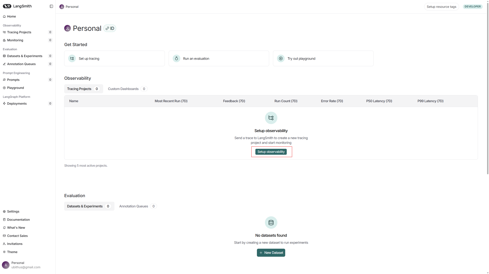
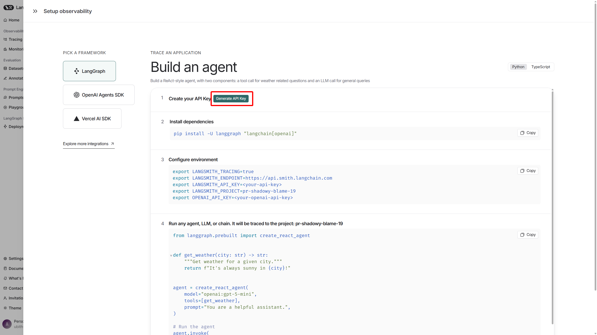

## LangSmith

> 공식문서: <https://docs.smith.langchain.com>

LangSmith는 대규모 언어 모델(LLM) 애플리케이션의 **개발, 디버깅, 평가, 모니터링**을 위한 통합 플랫폼이다. 프레임워크 비종속적으로 동작하며, LangChain/LangGraph 없이도 사용할 수 있다.

---

### 주요 기능

- **실행 추적(Tracing):** LLM 체인, 프롬프트, 모델 호출, 도구 사용 등 모든 구성요소의 입출력을 시각화 및 추적
- **가시성(Visibility):** 각 단계의 지연 시간, 토큰 사용량 등 성능 메트릭 실시간 확인
- **데이터셋 관리:** API/SDK를 통해 데이터셋 및 예시(Examples) 생성, 관리
- **평가 및 실험:** 데이터셋 기반 자동/수동 평가, LLM as Judge, 회귀 테스트, 실험 세션 관리
- **모니터링 및 로깅:** 실시간 응답 시간, 비용, 사용 통계, 사용자 피드백 수집 및 연동

---

### 활용법

#### 설치 및 사용법

1. LangSmith 로그인 후 `Setup observability` 버튼 클릭

   

2. `Generate API Key` 버튼 클릭

   

3. 의존성 설치

   ```bash
   `uv add langsmith`
   ```

4. 환경변수 적용

   ```bash
   LANGSMITH_TRACING=true
   LANGSMITH_ENDPOINT=https://api.smith.langchain.com
   LANGSMITH_API_KEY=<your-api-key>
   LANGSMITH_PROJECT=pr-long-king-1
   ```

> **메모:** 실행 추적(Tracing) 기능은 LangChain, LangGraph, OpenAI 등 주요 LLM 프레임워크에서 LangSmith 연동 설정만 하면 별도 코드 없이 https://smith.langchain.com/ 대시보드에서 자동 활성화된다. SDK 예시 코드는 데이터셋/예시 생성, 평가 자동화 등 고급 기능에 필요하다.

#### SDK 예시 (Python):

```python
from langsmith import Client
client = Client()
dataset = client.create_dataset("agent-qa")
examples = [
    {"inputs": {"question": "what's an agent"}, "outputs": {"answer": "an agent is..."}},
    # ...
]
client.create_examples(dataset_name="agent-qa", examples=examples)
```

#### API 엔드포인트:

- `/api/v1/examples` (예시 조회)
- `/api/v1/runs` (실행 기록 생성/수정)
- `/api/v1/sessions` (실험 세션 생성/수정)

---

### 배포 및 운영

- Helm Chart를 통한 쿠버네티스 배포 지원
- 자체 호스팅, 하이브리드, API-우선 설계, OTEL(OpenTelemetry) 표준 준수

---
