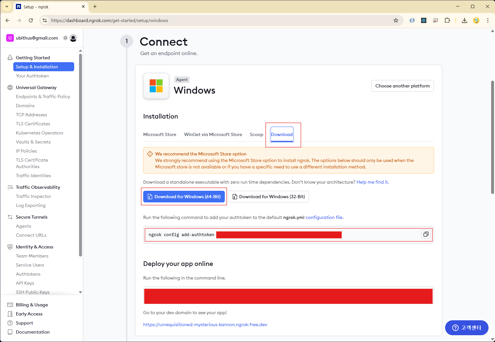

## ngrok

ngrok는 로컬 환경에서 개발 중인 웹 애플리케이션이나 서비스를 외부에서 접근할 수 있도록 해주는 **터널링 서비스**이다. 이 서비스는 복잡한 네트워크 설정이나 방화벽 규칙 변경 없이 안전하고 간편하게 로컬 서버를 인터넷에 노출시키는 기능을 제공한다.

---

### **ngrok의 주요 기능**

ngrok는 **HTTP**, **HTTPS**, **TCP** 터널링을 지원하며, 이를 통해 다양한 용도로 활용된다.

- **웹훅(Webhook) 테스트:** 결제 서비스, 메시징 플랫폼 등에서 웹훅 이벤트를 로컬 개발 서버로 전송받아 테스트할 수 있다.
- **API 테스트 및 시연:** 로컬에서 개발 중인 API를 외부 협업자나 클라이언트에게 보여주어 피드백을 받거나 시연할 때 유용하다.
- **개발용 서버 공유:** 외부에서 접속해야 하는 상황 (예: 모바일 애플리케이션 개발 중 로컬 API 서버 연동)에 로컬 서버를 임시로 노출시킨다.
- **TCP 포트 포워딩:** SSH, RDP 등 특정 TCP 포트를 사용하는 서비스에 대해 외부 접속을 허용한다.

---

### **동작 원리**

ngrok는 사용자의 로컬 컴퓨터에 설치된 클라이언트와 ngrok 클라우드 서버 간에 보안 터널을 생성한다. 사용자가 명령어를 실행하면, ngrok 클라이언트는 ngrok 서버에 연결하여 고유한 URL(예: `https://abcd1234.ngrok.io`)을 할당받는다. 이 URL로 들어오는 모든 트래픽은 ngrok 서버를 거쳐 암호화된 터널을 통해 사용자의 로컬 서버로 전달된다.

이 과정은 마치 **외부에서 로컬 서버로 직접 들어오는 통로**를 만들어주는 것과 같다. 덕분에 사용자는 라우터 포트 포워딩이나 방화벽 설정을 따로 할 필요 없이 자신의 컴퓨터를 공용 인터넷에 연결할 수 있다.

---

### **설치 방법 (Windows 기준)**

1. ngrok 사이트 접속: <https://ngrok.com>
2. 회원 가입: 구글 계정으로 쉽게 가입 가능
3. ngrok 설치: 로그인 > Setup & Installation
   

### **사용 방법 (예시)**

ngrok를 사용하는 가장 일반적인 방법은 터미널에서 간단한 명령어를 입력하는 것이다.

```sh
# 로컬 웹 서버 (8501번 포트)를 HTTP로 노출
ngrok http 8501
```

위 명령어를 실행하면 ngrok는 `http://localhost:8501`으로 들어오는 트래픽을 처리할 수 있는 공개 URL을 생성한다. 이 URL을 다른 사람에게 공유하면, 그 사람은 자신의 웹 브라우저를 통해 사용자의 로컬 웹 서버에 접속할 수 있다.

---
